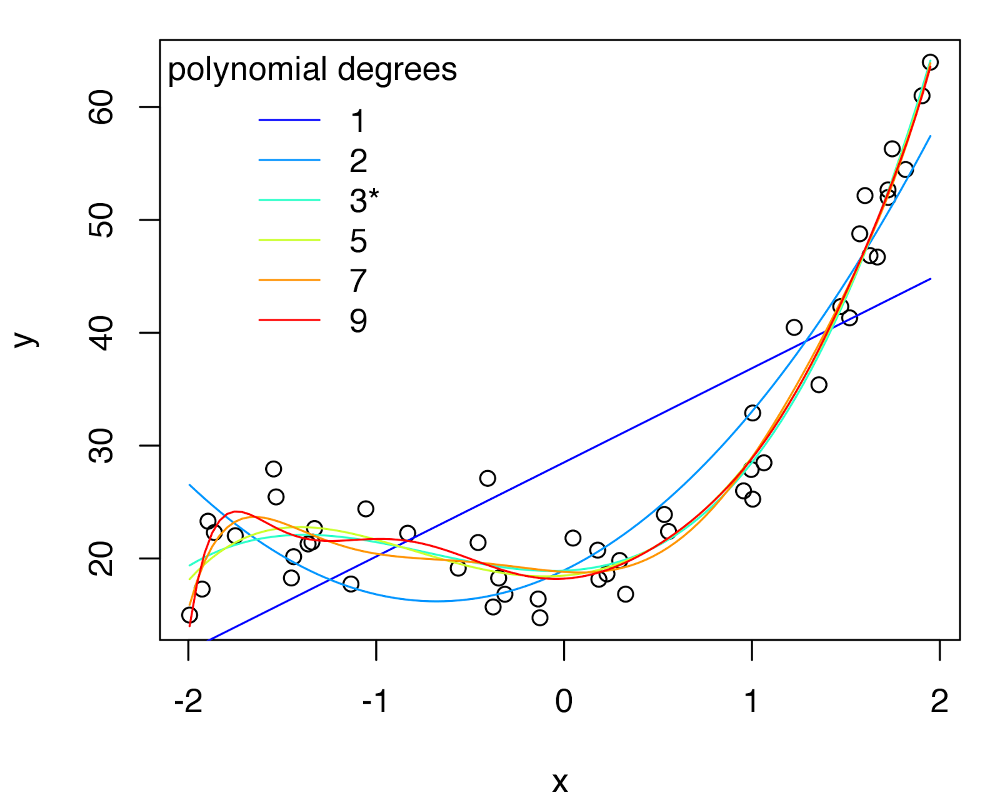

# Repositorio del curso 

## Machine Learning en Aplicaciones Espaciales

### Links

* Clase 1a: https://data-datum.github.io/flacso_ml/clases/clase01.html#1

* Clase 1b: https://data-datum.github.io/flacso_ml/clases/clase01b.html#1

* Práctica guiada: https://data-datum.github.io/flacso_ml/practicas/practica01-1.html#1

* Práctica guiada (Rmd): https://github.com/data-datum/flacso_ml/blob/main/practicas/practica01-1.Rmd

* Práctica individual: https://data-datum.github.io/flacso_ml/practicas/TP1.html#1

* Quizz-1: https://www.menti.com/cu3q9w32ff

* Quizz-2: https://www.menti.com/km4jbhvh1q

-------------------------------------------------------------------------------------------------------------------------------------------------

* Clase 2a: https://data-datum.github.io/flacso_ml/clases/clase02a.html#1

* Clase 2b: https://data-datum.github.io/flacso_ml/clases/clase02b.html#1

* Práctica guiada 2: https://data-datum.github.io/flacso_ml/practicas/practica-guiada-2.html

* Práctica guiada 2 (Rmd): https://github.com/data-datum/flacso_ml/blob/main/practicas/practica-guiada-2.Rmd

* Práctica individual: https://data-datum.github.io/flacso_ml/practicas/TP2.html#1

* Quiz-1 (árboles): https://www.menti.com/tzhqr8835t

* Quiz-2 (ensembles): https://www.menti.com/qk92cbopjc

* Práctica guiada 3: https://data-datum.github.io/flacso_ml/practicas/practica-guiada-3.html

* Práctica guiada 3 (Rmd): https://github.com/data-datum/flacso_ml/blob/main/practicas/practica-guiada-3.Rmd
-----------------------------------------------------------------------------------------------------------------------------------------------------

* Clase 3: https://data-datum.github.io/flacso_ml/clases/clase03a.html#1

* Práctica guiada 4: https://data-datum.github.io/flacso_ml/practicas/practica-guiada-4.html

* Práctica guiada 4 (Rmd): https://github.com/data-datum/flacso_ml/blob/main/practicas/practica-guiada-4.Rmd

* Práctica guiada 5: https://data-datum.github.io/flacso_ml/practicas/practica-guiada-5.html

* Práctica guiada 5 (Rmd): https://data-datum.github.io/flacso_ml/practicas/practica-guiada-5.Rmd

* Práctica individual 3 (Rmd): https://github.com/data-datum/flacso_ml/blob/main/practicas/TP3.Rmd

* Práctica individual 3 (html): https://data-datum.github.io/flacso_ml/practicas/TP3.html#1
