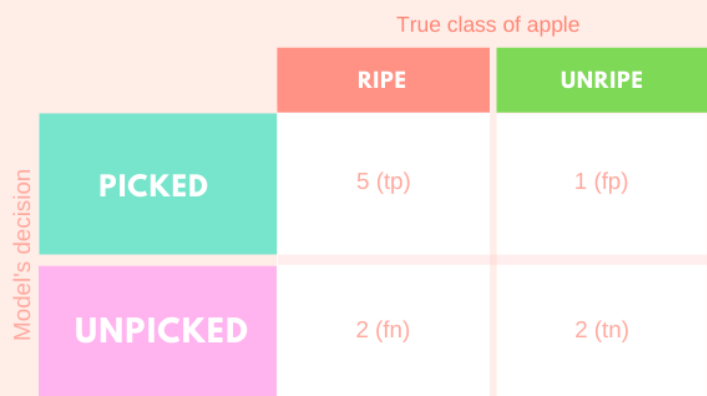
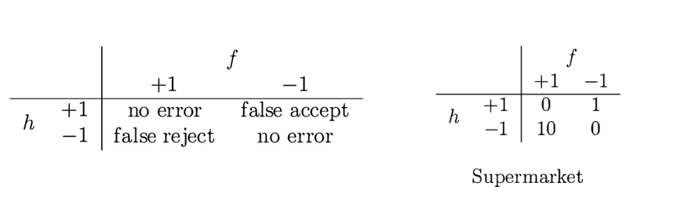
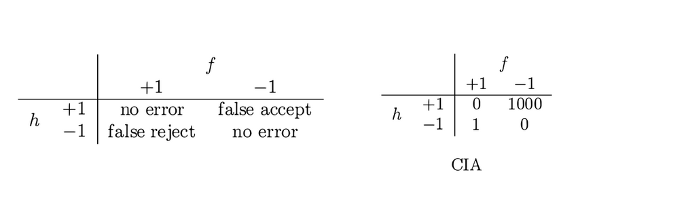

---
output:
  xaringan::moon_reader:
    lib_dir: libs
    css: xaringan-themer.css
    nature:
      highlightStyle: github
      highlightLines: true
      countIncrementalSlides: false
---

background-image: url(img/portada-flacso.png)
background-size: cover
class: animated slideInRight fadeOutLeft, middle

```{r xaringan-extra-styles, include=FALSE}
xaringanExtra::use_extra_styles(
  hover_code_line = TRUE,         #<<
  mute_unhighlighted_code = TRUE  #<<
)
```


```{r , echo=FALSE}
xaringanExtra::use_tachyons()
xaringanExtra::use_panelset()
```


```{r include=FALSE}
library(countdown)
```

```{r setup, include=FALSE}
options(htmltools.dir.version = FALSE)
```

```{r xaringan-themer, include=FALSE, warning=FALSE}
library(xaringanthemer)
#style_duo_accent(
#  primary_color = "#23395b",
#  secondary_color = "#23395b",
#  inverse_header_color = "#FFFFFF"
#)

style_duo_accent(
  header_font_google = google_font("Roboto", "500"),
  text_font_google   = google_font("Roboto", "400", "300i"),
  code_font_google   = google_font("Roboto")
)
```


```{r, message=FALSE, warning=FALSE, include=FALSE}
style_mono_accent(base_color = "#43418A")
```

```{r , message=FALSE, warning=FALSE, include=FALSE} 
library(fontawesome)
library(emo)
```


```{r xaringan-logo, echo=FALSE}
#xaringanExtra::use_fit_screen()
#xaringanExtra::use_logo("img/logo-tidymodels.png")
```


```{r xaringan-tachyons, echo=FALSE}
xaringanExtra::use_tachyons()
xaringanExtra::use_fit_screen()
```


# Machine Learning en Aplicaciones Espaciales


### Clase 1a: Genearalidades. Conceptos Fundamentales


---

###  Hoja de Ruta `r emo::ji("world_map")`

--
### Primer Parte `r emo::ji("alarm_clock")`

* Modelos de aprendizaje automático: fundamentos conceptuales (error de entrenamiento, error de generalización, balance sesgo-varianza), 
* Diferencias con el enfoque estadístico tradicional.

--

#### Recreo  `r emo::ji("tea")`

--


### Segunda Parte  `r emo::ji("alarm_clock")`
* Un primer modelo paso a paso

### Manos en R! `r emo::ji("computer")`

---

## Campo de ML

.bg-near-white.b--dark-blue.ba.bw2.br3.shadow-5.ph4.mt2[
El aprendizaje automático se trata de **extraer conocimiento de los datos** 
(*Andreas Müeller - Introduction to Machine Learning with Python*)
]

.bg-near-white.b--dark-blue.ba.bw2.br3.shadow-5.ph4.mt2[

El aprendizaje automático se ocupa de la **construcción de algoritmos que, para ser útiles, se basan en una colección de ejemplos de algún fenómeno.** Los ejemplos pueden provenir de la naturaleza, ser recolectados por humanos o generados por otro algoritmo.

El aprendizaje automático también se puede definir como el proceso de resolución de un **problema práctico** mediante,
1) recopilar un conjunto de datos y
2) entrenar algorítmicamente un modelo estadístico basado en ese conjunto de datos
(*Andriy Burkov - Machine Learning Engineering*)
]


---

## ¿Qué es el aprendizaje automático?


.left-column[

* Subcampo de la inteligencia artificial. 

* Machine Learning vs Deep Learning

* Funciones convexas - no convexas
]

.right-column[

```{r echo=FALSE, out.width = '60%',  fig.align='center'}

```


]


---

## El aprendizaje automático y otros campos relacionados


```{r echo=FALSE, out.width = '90%',  fig.align='center'}

```

Fuente: [link](https://ldi.upenn.edu/sites/default/files/Introduction-to-Machine-Learning.pdf)


---

## Cuando es apropiado utilizar ML para un problema

* Cuando el problema es muy complejo para programarlo. 


* Cuando el problema está constantemente cambiando.


* Cuando es un problema en el orden de la percepción (visión, lenguaje)


* Cuando es un fenómeno no estudiado. 


* Cuando es un problema con un objetivo simple.


.footnote[Fuente: *Machine Learning Engineering*]
---

## Tipos de aprendizaje
        
```{r echo=FALSE, out.width = '90%',  fig.align='center'}
knitr::include_graphics("img/ml.png")
```


---

## Machine Learning Clásico

        
```{r echo=FALSE, out.width = '90%',  fig.align='center'}
knitr::include_graphics("img/classicML.jpg")
```


---

## Clasificación

.left-column[

**Usado para:**

* Filtro de Spam (spam/jam)

* Detección de lenguaje (español, francés, etc)

* Análisis de sentimientos (positivo/negativo)

* Reconocer dígitos escritos a mano (0 al 9)


]

.right-column[

```{r echo=FALSE, out.width = '60%',  fig.align='center'}
knitr::include_graphics("img/classification.jpg")
```


]


---


## Regresión 


.left-column[

**Usado para:**

* Predicción de precios de casas según variables geográficas

* Establecer relaciones entre el ingreso y variables demográficas

* Predicción de accidentes automovilísticos


]

.right-column[

```{r echo=FALSE, out.width = '60%',  fig.align='center'}
knitr::include_graphics("img/regression.jpg")
```


]


---

## Aprendizaje supervisado (1)


```{r echo=FALSE, out.width = '90%',  fig.align='center'}

```

.footnote[Fuente: *Machine Learning with R, the tidyverse and mlr*]


---


## Aprendizaje supervisado (2)

```{r echo=FALSE, out.width = '90%',  fig.align='center'}

```

.footnote[Fuente: *Machine Learning with R, the tidyverse and mlr*]


---


## Clusterizado (clustering)


.left-column[

**Usado para:**

*  Segmentación de mercado (tipo de consumidores, lealtad)

*  Analizar y agregar un rótulo en nuevos datos. 


]

.right-column[

```{r echo=FALSE, out.width = '60%',  fig.align='center'}
knitr::include_graphics("img/clustering.jpg")
```


]


---

## Reducción de dimensiones


.left-column[

**Usado para:**

- Sistemas de recomendación 

- Visualización del problema que nos interesa. 

- Modelado de tópicos


]

.right-column[

```{r echo=FALSE, out.width = '60%',  fig.align='center'}
knitr::include_graphics("img/PCA.jpg")
```


]


---

## Aprendizaje no supervisado (1)


```{r echo=FALSE, out.width = '90%',  fig.align='center'}

```

.footnote[Fuente: *Machine Learning with R, the tidyverse and mlr*]


---

## Aprendizaje no supervisado (2)


```{r echo=FALSE, out.width = '90%',  fig.align='center'}

```

.footnote[Fuente: *Machine Learning with R, the tidyverse and mlr*]


---

## Conceptos Importantes `r emo::ji("bulb")`

* __Muestra, punto, observación, instancia__ se refiere a una unidad de análisis.
<br>

* __Set de entrenamiento__ son los datos utilizados para el modelado. 
<br>

* __Set de prueba__ son los datos utilizados para medir el desempeño del modelo, entre un conjunto de candidatos. 
<br>

* __Atributos, predictores, features, variables independientes o descriptores__ son los datos de entrada para la ecuación de predicción.
<br> 
* __Salida, variable dependiente, variable respuesta, clase, o "target"__ es la cantidad/clase a ser predicha. 
<br>


.footnote[Fuente: *Applied Predictive Modeling*]


---

## Conceptos Importantes `r emo::ji("bulb")`


* __Parámetros__ son variables que definen el modelo entrenado mediante aprendizaje. Los parámetros son directamente modificados por el algoritmo de aprendizaje basado en los datos de entrenamiento. Ej, la pendiente y la ordenada de una recta en regresión lineal simple. 
<br>

* __Hiperparámetros__ son *variables internas* de un algoritmo de ML que influencian la performance del modelo. No pueden ser aprendidos mediante el algoritmo de ML, ya que son definidos por el usuario, aunque lo más común es realizar una búsqueda de hiperparámetros (en grilla o de manera aleatoria son las formas de búsqueda más comunes).
Ej: profundidad de un árbol en árboles de decisión, el K óptima en KNN.


.footnote[Fuente: *Machine Learning Engineering*]


---

## Modelado. Las dos culturas


```{r echo=FALSE, out.width = '70%',  fig.align='center'}

```

.footnote[Fuente: *http://www2.math.uu.se/~thulin/mm/breiman.pdf*]


---

## Modelado Estadístico


  
```{r echo=FALSE, out.width = '50%',  fig.align='center'}

```


* Énfasis en f(x). El modelo se postula en base a supuestos sobre f(x)
* Conocimiento acumulado, teoría, diseño de experimentos.
* Los parámetros son estimados con los datos y luego se realizan las
predicciones.
* Evaluación del modelo: estimadores insesgados, robustos, mínima
varianza. 


.footnote[Fuente: *http://www2.math.uu.se/~thulin/mm/breiman.pdf*]

---

## Modelado Algorítmico (a.k.a ML)


  
```{r echo=FALSE, out.width = '50%',  fig.align='center'}
knitr::include_graphics("img/alg-model.png")
```


* Énfasis en la predicción. 
* El enfoque es encontrar una función f (x) -un algoritmo- que opera
sobre las x para predecir las y.
* El modelo se “aprende” de los datos
* Evaluación del modelo: performance predictiva


.footnote[Fuente: *http://www2.math.uu.se/~thulin/mm/breiman.pdf*]


---


### Etapas de un problema de machine learning supervisado (1)


* **Definir el problema** ¿Qué se pretende predecir? ¿De qué datos se dispone? o ¿Qué datos es necesario conseguir?

* **Explorar y entender los datos** que se van a emplear para crear el modelo.

* **Preprocesar los datos** aplicar las transformaciones necesarias para que los datos puedan ser interpretados por el algoritmo de machine learning seleccionado.

* **Métrica de éxito** definir una forma apropiada de cuantificar cómo de buenos son los resultados obtenidos.

* **Preparar la estrategia para evaluar el modelo** separar las observaciones en un conjunto de entrenamiento, un conjunto de validación (o validación cruzada) y un conjunto de test. Es muy importante asegurar que ninguna información del conjunto de test participa en el proceso de entrenamiento del modelo.


---

### Etapas de un problema de machine learning supervisado (2)

* **Ajustar un primer modelo** capaz de superar unos resultados mínimos. Por ejemplo, en problemas de clasificación, el mínimo a superar es el porcentaje de la clase mayoritaria (la moda).

* Gradualmente, **mejorar el modelo** incorporando-creando nuevas variables u optimizando los hiperparámetros.

* **Evaluar la capacidad del modelo final** con el conjunto de test para tener una estimación de la capacidad que tiene el modelo cuando predice nuevas observaciones.

* **Entrenar el modelo final** con todos los datos disponibles.


.footnote[Fuente: *https://www.cienciadedatos.net/documentos/59_machine_learning_con_r_y_tidymodels*]
---


## ¿Qué es EDA? `r emo::ji("mag_right")`

.bg-near-white.b--dark-blue.ba.bw2.br3.shadow-5.ph4.mt2[
### **EDA** o Análisis Exploratorio de Datos 

#### es un ciclo iterativo y un proceso creativo en donde, 

#### - **Generas preguntas acerca de tus datos.**

#### - **Buscas respuestas mediante la visualización y transformación de los mismos.**

#### - **En base a lo aprendido, refinas tus preguntas e incluso, generas nuevas.**

]
.footnote[Fuente:*[R para Ciencia de  Datos](https://es.r4ds.hadley.nz/an%C3%A1lisis-exploratorio-de-datos-eda.html)]*

---

## Cobran especial importancia en esta etapa


.bg-near-white.b--dark-blue.ba.bw2.br3.shadow-5.ph4.mt2[

#### Estudio de la distribución de las variables

#### Presencia de valores perdidos

#### Desbalance de las clases o grupos en estudio

#### Presencia de datos extremos o outliers 

#### Covariación/correlación de variables

]

.footnote[Fuente: *[R para Ciencia de  Datos](https://es.r4ds.hadley.nz/an%C3%A1lisis-exploratorio-de-datos-eda.html)]*
---

## ¿Por qué es importante el Análisis exploratorio de datos? `r emo::ji("bulb")`

.bg-near-white.b--dark-blue.ba.bw2.br3.shadow-5.ph4.mt5[

### Porque te permite conocer y entender tus datos. ]


---

### Curación de datos `r emo::ji("ambulance")`

.bg-near-white.b--dark-blue.ba.bw2.br3.shadow-5.ph4.mt2[
### **Curación de Datos** o Ingeniería de Features 

#### es una etapa en la cual **seleccionamos** y **transformamos** las variables 

#### - **Puede haber combinación de datasets (enriquecimiento)**

#### - **Vemos que variables son relevantes (feature selection)**

#### - **Limpieza de datos (inconsistencias)**

]


---


## Cobran especial importancia en esta etapa


.bg-near-white.b--dark-blue.ba.bw2.br3.shadow-5.ph4.mt2[

#### Imputación de datos ruidosos, perdidos o erroneos. 

#### Codificación de variables categóricas. 

#### Transformación de variables.

#### Ingeniería de outliers. 

#### Escalado de Features

#### Discretización de variables (continuas ---> discretas)

]


---

## ¿Por qué es importante la Curación de datos? `r emo::ji("bulb")`

.bg-near-white.b--dark-blue.ba.bw2.br3.shadow-5.ph4.mt5[

### Porque permite transformar los datos para que tengan una forma adecuada para modelarlos.

### Tener en cuenta que en esta etapa siempre se introduce SESGO.

]


---


## Modelado Algorítmico - ML

Podemos decir que modelar (mediante ML) implica pensar en todos estos aspectos:

* Train - test split (Cómo vamos a dividir los datos)
* Complejidad / Interpretabilidad del modelo. 
* Error de entrenamiento - error de generalización
* Métricas
* Underfitting - Overfitting


---

## Train - Test Split


```{r echo=FALSE, out.width = '70%',  fig.align='center'}

```


---


## Entrenamiento, validación y testeo


```{r echo=FALSE, out.width = '40%',  fig.align='center'}

```


.footnote[Fuente: *https://www.tmwr.org/resampling.html*]


---

## Resampleo 

El resampleo se utiliza en ML para estimar el desempeño de un modelo. 


```{r echo=FALSE, out.width = '100%',  fig.align='center'}

```


.footnote[Fuente: *https://www.tmwr.org/resampling.html*]

---


## Validación cruzada


```{r echo=FALSE, out.width = '100%',  fig.align='center'}

```


.footnote[Fuente: *https://www.tmwr.org/resampling.html*]

---


.bg-near-white.b--purple.ba.bw2.br3.shadow-5.ph4.mt5[
### La validación cruzada se utiliza para estimar el error de generalización de un modelo y también para hacer optimización de hiperparámetros. 
 
]


---
## Bootstraping 


```{r echo=FALSE, out.width = '100%',  fig.align='center'}

```


.footnote[Fuente: *https://www.tmwr.org/resampling.html*]
---


.bg-near-white.b--purple.ba.bw2.br3.shadow-5.ph4.mt5[
### Tanto validación cruzada como bootstrap son técnicas de resampleo (resampling).
### La diferencia radica en que la validación cruzada no es con reemplazo mientras que bootstrap sí lo es. 
]


---

## Modelos 

*Interpretabilidad vs Flexibilidad*

```{r echo=FALSE, out.width = '100%',  fig.align='center'}

```


.footnote[Fuente: *Introduction to Statistical Learning*]

---

## Métricas


.bg-near-white.b--dark-blue.ba.bw2.br3.shadow-5.ph4.mt2[

#### Durante el modelado de datos es probable que no hagamos un solo modelo, sino varios. 
#### La manera de saber qué tan buenos son, es evaluar esos algoritmos mediante métricas.
#### Tenemos métricas de regresión y clasificación.
<br>

]

---

### Métricas para Regresión

* Mean Square Error (MSE)


```{r echo=FALSE, out.width = '40%',  fig.align='center'}

```


* Root Mean Square Error (RMSE)


```{r echo=FALSE, out.width = '40%',  fig.align='center'}

```


* Mean Absolute Error (MAE)


```{r echo=FALSE, out.width = '40%',  fig.align='center'}

```


---

### Métricas para Clasificación

Supongamos que se desea realizar una clasificación en la que disponemos de dos clases etiquetadas como Positivo y Negativo. 

A su vez, disponemos de un modelo en el cual las predicciones no coinciden 100% con las clases verdaderas. 
  
```{r echo=FALSE, out.width = '100%',  fig.align='center'}

```

---

### Positivos verdaderos
     
  
```{r echo=FALSE, out.width = '100%',  fig.align='center'}

```


---

### Falsos positivos 
  
```{r echo=FALSE, out.width = '100%',  fig.align='center'}

```


---

### Negativos verdaderos
  
```{r echo=FALSE, out.width = '100%',  fig.align='center'}

```

---

### Falsos Negativos  
  
```{r echo=FALSE, out.width = '100%',  fig.align='center'}

```


---

## Matriz de Confusión

Todo lo anterior puede resumirse en la Matriz de Confusión
      
  
```{r echo=FALSE, out.width = '100%',  fig.align='center'}
knitr::include_graphics("img/matriz-confusion.png")
```

    


.footnote[Traducido de 10.7717/peerj.5666/fig-2]


---

## Precision vs Recall 

* Uno podria elegir trabajar con las métricas de Precision o Recall para un problema desbalanceado. 
Maximinar la precisión minimizará los FALSOS POSITIVOS, mientras que el Recall minimizará los FALSOS
NEGATIVOS. 
* Entonces, podria ser adecuado trabajar con:

.bg-near-white.b--dark-blue.ba.bw2.br3.shadow-5.ph4.mt2[

#### Precisión: Cuando el objetivo es minimizar los falsos positivos. 


#### Recall: Cuando el objetivo es minimizar los falsos negativos. 


]


---

## F1 score


Cuando me interesan tanto los FP como los FN, de igual forma, voy a utilizar el F1-score. 

<br><br><br>
```{r echo=FALSE, out.width = '80%',  fig.align='center'}
knitr::include_graphics("img/f1.svg")
```

.footnote[*https://deepai.org/machine-learning-glossary-and-terms/f-score*]

---

### Entendamos el F1-Score

Supongamos que tenemos una máquina recolectora de frutas, siendo que algunas de ellas están maduras y otras no. 


  
```{r echo=FALSE, out.width = '80%',  fig.align='center'}
knitr::include_graphics("img/ripe-apples.png")
```


.footnote[*https://deepai.org/machine-learning-glossary-and-terms/f-score*]

---


```{r echo=FALSE, out.width = '50%',  fig.align='center'}

```


```{r echo=FALSE, out.width = '80%',  fig.align='center'}
knitr::include_graphics("img/f1-c.png")
```


.footnote[*https://deepai.org/machine-learning-glossary-and-terms/f-score*]


---

### Importante  `r emo::ji("bulb")`


.bg-near-white.b--dark-blue.ba.bw2.br3.shadow-5.ph4.mt2[

### La accuracy o exactitud es una métrica apropiada en datasets balanceados. 

### En caso de estar lidiando con datasets desbalanceados deberemos usar la métrica apropiada (o balancear nuestros datos).  

]

.footnote[*https://machinelearningmastery.com/tour-of-evaluation-metrics-for-imbalanced-classification/*]


---

### Importante  `r emo::ji("bulb")`


.bg-near-white.b--dark-blue.ba.bw2.br3.shadow-5.ph4.mt2[

## Determinar que error es más grave (FP o FN) lo determina el contexto de aplicación del problema.

Veamos un ejemplo práctico
]


---

## FP vs FN


```{r echo=FALSE, out.width = '70%',  fig.align='center'}
knitr::include_graphics("img/cia-market.png")
```


Consideremos dos clientes potenciales de un sistema de huellas dactilares. 

* Uno es un **supermercado** que lo usará en el mostrador de pago para verificar que usted es miembro
de un programa de descuento. 
* El otro es la **CIA** que lo usará en la entrada de una instalación, para verificar que Ud es personal autorizado para ingresar a esa instalación.

.footnote[Fuente: *Learning from data*]
---

### FP vs FN


* Para el supermercado, un **falso rechazo (falso negativo) es costoso** porque si un cliente recibe un 
rechazo erróneamente, puede desanimarse de seguir siendo cliente en el futuro. 
* Por otro lado, el costo de una **falsa aceptación (falso positivo) es menor**. El supermercado regala un descuento a alguien que no se lo merecía, sin mayores prejuicios para el supermercado. 


.footnote[Fuente: *Learning from data*]

--


```{r echo=FALSE, out.width = '100%',  fig.align='center'}

```


.footnote[Fuente: *Learning from data*]

---

### FP vs FN

* Para la CIA, sin embargo, una **falsa aceptación (falso positivo) es un desastre**. Una persona no autorizada se beneficiará del acceso a una instalación muy sensible. 
* **El falso rechazo (falso negativo)**, sin embargo, **puede tolerarse**, ya que las personas autorizadas son empleados (en lugar de clientes como el caso del supermercado).


.footnote[Fuente: *Learning from data*]

--


```{r echo=FALSE, out.width = '100%',  fig.align='center'}

```


.footnote[Fuente: *Learning from data*]

---

### Curvas ROC

La curva ROC (receiver operating characteristic) relaciona el recall con el ratio de falsos positivos. Es decir relaciona la sensibilidad de nuestro modelo con los fallos optimistas (clasificar los negativos como positivos). Tiene sentido ya que, generalmente, si aumentamos el recall, nuestro modelo tenderá a ser más optimista e introducirá mas falsos positivos en la clasificación.

En las curvas ROC, nos interesa que la curva se acerque lo máximo posible a la esquina superior izquierda de la gráfica, de manera que el hecho de aumentar la sensibilidad (el recall) no haga que nuestro modelo introduzca más falsos positivos.

El AUC es conveniente por las dos razones siguientes:

* El AUC es invariable con respecto a la escala. Mide qué tan bien se clasifican las predicciones, en lugar de sus valores absolutos.
* El AUC es invariable con respecto al umbral de clasificación. Mide la calidad de las predicciones del modelo, sin tener en cuenta qué umbral de clasificación se elige.


.footnote[Fuente: *https://developers.google.com/machine-learning/crash-course/classification/roc-and-auc?hl=es*]


---

### Curvas ROC


```{r echo=FALSE, out.width = '50%',  fig.align='center'}
knitr::include_graphics("img/roc-auc.png")
```


La curva ROC nos permite obtener el AUC o área bajo la curva. El AUC oscila en valor del 0 al 1. Un modelo cuyas predicciones son un 100% incorrectas tiene un AUC de 0.0; otro cuyas predicciones son un 100% correctas tiene un AUC de 1.0.


.footnote[Fuente: *https://developers.google.com/machine-learning/crash-course/classification/roc-and-auc?hl=es*]


---

## 


.bg-near-white.b--dark-blue.ba.bw2.br3.shadow-5.ph4.mt5[

La curva ROC es independiente del threshold seleccionado.

]

 


.footnote[Fuente: *https://paulvanderlaken.com/2019/08/16/roc-auc-precision-and-recall-visually-explained/*]

---

### Underfitting - Overfitting

  
```{r echo=FALSE, out.width = '80%',  fig.align='center'}
knitr::include_graphics("img/under-over.png")
```

.footnote[*https://stanford.edu/~shervine/teaching/cs-229/cheatsheet-machine-learning-tips-and-tricks*]

---

### Underfitting

Cuando un modelo comete muchos errores en el entrenamiento, decimos que tienen un **alto bias**, que underfittea o que el ajuste es pobre. Esto se puede presentar debido a:

* El modelo es muy simple para los datos. 
* Los features, variables (columnas) son poco informativos sobre el problema. 

*Posibles soluciones:*

* Probar un modelo más complejo. 
* Mejores Features
* Conseguir más datoss.

.footnote[*Machine Learning Engineering*]
---

### Overfitting

Cuando un modelo tiene una buena performance en el set de validación pero mala perfomance en test, se dice que el modelo **sobreajusta u overfittea**. También se dice, que el modelo *memoriza* los datos de entrenamiento por eso no generalizará bien frente a nuevos datos.  Un modelo que sobreajusta, tiene una **alta varianza**

* El modelo es muy complejo para los datos. 
* Los features, variables (columnas) son muchas para la cantidad de filas. 

*Posibles soluciones:*

* Probar un modelo más simple. 
* Menos Features
* Conseguir más datos.


.footnote[*Machine Learning Engineering*]

---

### Importante

.bg-near-white.b--dark-blue.ba.bw2.br3.shadow-5.ph4.mt2[

### El objetivo de un modelo de ML siempre es que pueda generalizar bien frente a nuevos datos o datos no vistos por el modelo. 


]


---

## Bias - Variance tradeoff

En la práctica, por reducir la varianza, se incrementa el bias, y viceversa. En otras palabras, por reducir el overfitting se aumenta el underfitting y viceversa. A esto llamamos bias-variance tradeoff. Por tener un modelo que ajuste de manera perfecta el set de training terminamos con un modelo pobre para los datos de test. 

  
```{r echo=FALSE, out.width = '50%',  fig.align='center'}

```


.footnote[*Machine Learning Engineering*]

---

### Sesgo - varianza


```{r echo=FALSE, out.width = '60%',  fig.align='center'}

```


---


## Bias - Variance tradeoff
(Balance sesgo-varianza)

```{r echo=FALSE, out.width = '80%',  fig.align='center'}

```


*Para una introducción visual ver: http://www.r2d3.us/visual-intro-to-machine-learning-part-2/*


.footnote[*Machine Learning with R, the tidyverse and mlr*]
---

class: inverse, center, middle

## Software


---

## De caret a `tidymodels`


.pull-left[
El objetivo de caret era **unificar la sintaxis** para modelizar datos usando como base distintas librerías de R. 

]

--

.pull-right[
El objetivo de Tidymodels es además hacerlo **en un formato ordenado**. 


]


---

### Etapas del modelado de datos


  
```{r echo=FALSE, out.width = '100%',  fig.align='center'}

```

.footnote[Fuente: *https://www.tmwr.org/software-modeling.html*]


---

### `tidymodels`


```{r echo=FALSE, out.width = '100%',  fig.align='center'}

```

---

## Librerías de `tidymodels`


.left-column[
### `library(rsample)`
__Librería que nos permite hacer división del set de datos__

]

.right-column[

```{r echo=FALSE, out.width = '40%',  fig.align='center'}
knitr::include_graphics("img/rsample.png")
```

]


---

## Librerías de `tidymodels`

.left-column[
#### `library(rsample)`
### `library(recipes)`
__Permite hacer preprocesamiento de los datos__
]

.right-column[

```{r echo=FALSE, out.width = '40%',  fig.align='center'}
knitr::include_graphics("img/recipes.png")
```


]

---
## Librerías de `tidymodels`

.left-column[
#### `library(rsample)`
#### `library(recipes)`
### `library(parsnip)`
__Permite unificar los modelos a optimizar__
]

.right-column[

```{r echo=FALSE, out.width = '40%',  fig.align='center'}
knitr::include_graphics("img/parsnip.png")
```


]


---
## Librerías de `tidymodels`

.left-column[
#### `library(rsample)`
#### `library(recipes)`
#### `library(parsnip)`
### `library(workflows)`
__Nos permite unificar el flujo de trabajo__

]

.right-column[

```{r echo=FALSE, out.width = '40%',  fig.align='center'}
knitr::include_graphics("img/workflow.png")
```


]


---
## Librerías de `tidymodels`

.left-column[
#### `library(rsample)`
#### `library(recipes)`
#### `library(parsnip)`
#### `library(workflows)`
### `library(tune)`
__Permite el tuneo de los hiperparámetros de los modelos__
]

.right-column[

```{r echo=FALSE, out.width = '40%',  fig.align='center'}
knitr::include_graphics("img/tune.png")
```


]


---

## Librerías de `tidymodels`

.left-column[
#### `library(rsample)`
#### `library(recipes)`
#### `library(parsnip)`
#### `library(workflows)`
#### `library(tune)`
### `library(yardstick)`
__Permite evaluar las métricas de los modelos__
]

.right-column[

```{r echo=FALSE, out.width = '40%',  fig.align='center'}

```


]


---

## Bibliografía


* Introduction to Statistical Learning. 
https://www.statlearning.com/ 

* Applied Predictive Modelling

* Learning from data

* Tidy Modeling with R. https://www.tmwr.org/ 

* Breimann, L. Statistical Modeling: The Two Cultures (paper)
http://www2.math.uu.se/~thulin/mm/breiman.pdf 

* Mehta, P. et al. A high-bias, low-variance introduction to Machine Learning
for physicists (paper)
https://www.sciencedirect.com/science/article/pii/S0370157319300766 

* Imágenes tomadas de https://vas3k.com/blog/machine_learning/ 

* Machine Learning Engineering http://www.mlebook.com/wiki/doku.php 