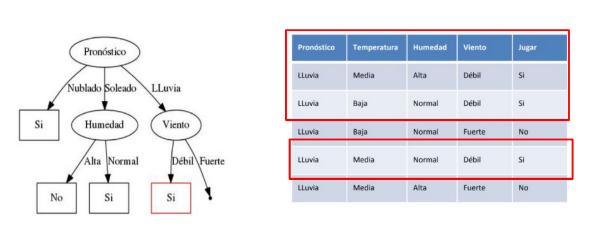
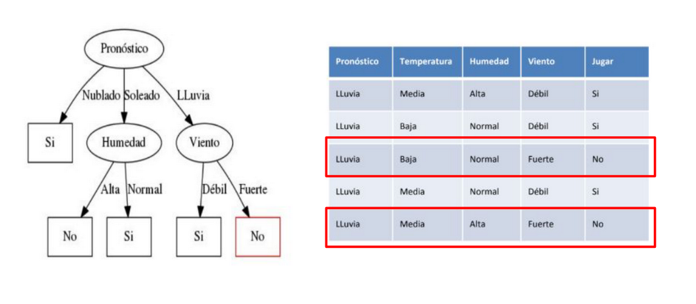
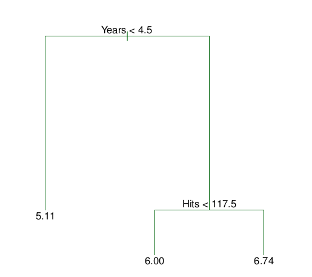

---
output:
  xaringan::moon_reader:
    lib_dir: libs
    css: xaringan-themer.css
    nature:
      highlightStyle: github
      highlightLines: true
      countIncrementalSlides: false
---

background-image: url(img/portada-flacso.png)
background-size: cover
class: animated slideInRight fadeOutLeft, middle

```{r xaringan-extra-styles, include=FALSE}
xaringanExtra::use_extra_styles(
  hover_code_line = TRUE,         #<<
  mute_unhighlighted_code = TRUE  #<<
)
```


```{r , echo=FALSE}
xaringanExtra::use_tachyons()
xaringanExtra::use_panelset()
```


```{r include=FALSE}
library(countdown)
```

```{r setup, include=FALSE}
options(htmltools.dir.version = FALSE)
```

```{r xaringan-themer, include=FALSE, warning=FALSE}
library(xaringanthemer)
#style_duo_accent(
#  primary_color = "#23395b",
#  secondary_color = "#23395b",
#  inverse_header_color = "#FFFFFF"
#)

style_duo_accent(
  header_font_google = google_font("Roboto", "500"),
  text_font_google   = google_font("Roboto", "400", "300i"),
  code_font_google   = google_font("Roboto")
)
```


```{r, message=FALSE, warning=FALSE, include=FALSE}
style_mono_accent(base_color = "#43418A")
```

```{r , message=FALSE, warning=FALSE, include=FALSE} 
library(fontawesome)
library(emo)
```


```{r xaringan-logo, echo=FALSE}
#xaringanExtra::use_fit_screen()
#xaringanExtra::use_logo("img/logo-tidymodels.png")
```


```{r xaringan-tachyons, echo=FALSE}
xaringanExtra::use_tachyons()
xaringanExtra::use_fit_screen()
```


# Machine Learning en Aplicaciones Espaciales


### Clase 1b: Introducción a Árboles de Decisión


---

## Árboles de decisión.


* Los **árboles de decisión** son modelos predictivos formados por reglas binarias (si/no) con las que se consigue repartir las observaciones en función de sus atributos y predecir así el valor de la variable respuesta.


--

* Los **árboles de regresión** son el subtipo de árboles de predicción que se aplica cuando la **variable respuesta es continua**. En términos generales, en el entrenamiento de un árbol de regresión, las observaciones se van distribuyendo por **bifurcaciones (nodos)** generando la estructura del árbol hasta alcanzar un **nodo terminal**. Cuando se quiere predecir una nueva observación, se recorre el árbol acorde al valor de sus predictores hasta alcanzar uno de los nodos terminales. La **predicción del árbol es la media de la variable respuesta de las observaciones de entrenamiento que están en ese mismo nodo terminal**.

--

* Pueden usarse para **regresión** y **clasificación**


---

## Árboles para regresión y clasificación


.bg-near-white.b--purple.ba.bw2.br3.shadow-5.ph4.mt5[
###  En *clasificación*, nuestro objetivo es que un nodo permita la separación de los datos en grupos lo más homogéneos posibles. 
###  En *regresión*, en cambio, nos interesa que los nodos permitan separar los datos en grupos en los cuales el error de predicción sea bajo. 
]


---

## Árbol de clasificación


Vamos a suponer que tenemos un dataset que tiene la siguiente forma. La idea es que nos ayude a predecir si podemos o no jugar al golf cuando llueve. 


```{r echo=FALSE, out.width = '100%',  fig.align='center'}

```


---


La primer variable que vamos a considerar es el **Pronóstico**, vemos como esa variable se relaciona con la que intentamos predecir. 
<br>
Las posibilidades en **Pronóstico** son:

* Nublado
* Soleado
* Lluvia

Veamos que pasa cuando el **Pronóstico** es NUBLADO. 

--


```{r echo=FALSE, out.width = '100%',  fig.align='center'}

```

---

Veamos que sucede cuando el **Pronóstico** es SOLEADO 
```{r echo=FALSE, out.width = '100%',  fig.align='center'}

```


.bg-near-white.b--purple.ba.bw2.br3.shadow-5.ph4.mt5[
¿Qué variable nos conviene para tener nodos más homógeneos?
]


---


Vamos a elegir la variable **Humedad**

```{r echo=FALSE, out.width = '100%',  fig.align='center'}
knitr::include_graphics("img/trees-clas04.png")
```


.bg-near-white.b--purple.ba.bw2.br3.shadow-5.ph4.mt5[
Cuando la humedad es ALTA, no voy a jugar al golf. 
]


---


```{r echo=FALSE, out.width = '100%',  fig.align='center'}

```


.bg-near-white.b--purple.ba.bw2.br3.shadow-5.ph4.mt5[
Sin embargo, cuando la humedad es NORMAL, sí voy a jugar al golf. 
]


---

Veamos que sucede ahora con **Pronóstico** de Lluvia

```{r echo=FALSE, out.width = '100%',  fig.align='center'}

```


.bg-near-white.b--purple.ba.bw2.br3.shadow-5.ph4.mt5[
Debemos dividir el nodo eligiendo una nueva variable que nos permita tener los nodos más homogeneos.
]


---


```{r echo=FALSE, out.width = '100%',  fig.align='center'}

```


.bg-near-white.b--purple.ba.bw2.br3.shadow-5.ph4.mt5[
Si elegimos la variable VIENTO, puedo obtener nodos más homogeneos. 
]


---


```{r echo=FALSE, out.width = '100%',  fig.align='center'}

```


.bg-near-white.b--purple.ba.bw2.br3.shadow-5.ph4.mt5[
Cuando llueve, y el viento es DEBIL, voy a jugar al golf. 
]


---


```{r echo=FALSE, out.width = '100%',  fig.align='center'}

```


.bg-near-white.b--purple.ba.bw2.br3.shadow-5.ph4.mt5[
Sin embargo, cuando llueve, pero el viento es FUERTE, no voy a jugar al golf. 
]


---
## Árbol de regresión

El set de datos `Hitter` contiene información sobre 322 jugadores de béisbol de la liga profesional. 

--

Entre las variables registradas para cada jugador se encuentran: el **salario (Salary)**, **años de experiencia (Years)** y el **número de bateos durante los últimos años (Hits)**. Utilizando estos datos, se quiere **predecir el salario (en unidades logarítmicas)** de un jugador en base a su experiencia y número de bateos.

--

```{r message=FALSE, warning=FALSE}
library(ISLR)
library(magrittr)
library(tidyverse)
data(Hitters)
head(Hitters) %>%
  select(Years, Salary, Hits) 
```


---
```{r}
Hitters %>%
  select(Years, Salary, Hits) %>%
  summary()
```


---

Si realizamos un *árbol de regresión con estas variables*:

```{r echo=FALSE, out.width = '50%',  fig.align='center'}

```
---


Como resultado de las bifurcaciones, se han generado 3 regiones que pueden identificarse con la siguiente nomenclatura:

$R_{1} = \left \{ X | Year < 4.5  \right \}$ : jugadores que han jugado menos de 4.5 años.

$R_{2} = \left \{ X | Year \geq   4.5, Hits <  117.5 \right \}$ : jugadores que han jugado 4.5 años o más y que han conseguido menos de 117.5 bateos.

$R_{3} = \left \{ X | Year \geq   4.5, Hits  \geq   117.5 \right \}$ : jugadores que han jugado 4.5 años o más y que han conseguido 117.5 o más bateos.

El valor que aparece en cada hoja es la media de las observaciones que están en esa hoja. 

```{r echo=FALSE, out.width = '60%',  fig.align='center'}

```


---


class: inverse, center, middle


## ¿Podemos seguir dividiendo el árbol?

--
## ¿Hasta cuando?

---

## ¿Podemos seguir dividiendo el árbol?

.bg-near-white.b--dark-blue.ba.bw2.br3.shadow-5.ph4.mt2[
En el caso de los **árboles de regresión**, el criterio empleado con más frecuencia para identificar las divisiones es el **Residual Sum of Squares (RSS)**. El objetivo es encontrar las J regiones (R1,…, Rj) que minimizan el Residual Sum of Squares (RSS) total

$RSS = \sum_{j=1}^{J}\sum_{i \epsilon R_{j}}^{} (y_{i} - \widehat{y}_{R_{j}})^{2}$

]


.bg-near-white.b--dark-blue.ba.bw2.br3.shadow-5.ph4.mt2[
En el caso de los **árboles de clasificación**, nos van a interesar en partícular, la impureza. Dicho en otras palabras, que los nodos que vamos a crear, sean los más homogeneos posibles. 

]

---

## ¿Hasta cuándo?

.bg-near-white.b--dark-blue.ba.bw2.br3.shadow-5.ph4.mt2[
## Podríamos detenernos cuando todas las hojas tengan exactamente las mismas muestras, aún siendo, muy pocas. Esto es factible, pero la profundidad del árbol sería alta, y nos llevaría a sobreajustar el modelo. 
]

---

## Overfitting en árboles


```{r echo=FALSE, out.width = '100%',  fig.align='center'}

```


---

## Overfitting en árboles de regresión 


```{r echo=FALSE, out.width = '90%',  fig.align='center'}

```


**¿Cómo controlo el overfitting en árboles?**

* Controlar profundidad del árbol.
* Controlar la cantidad de hojas (para armar una cantidad fija de grupos de datos).
* Controlar la mínima cantidad de datos que están contenidos dentro de cada hoja (para hacer, por ejemplo, promedios más robustos).
* Controlar el hiperparámetro de regularización. 

---


## Ventajas `r emo::ji("heavy_check_mark")`


* Los árboles son fáciles de interpretar aun cuando las relaciones entre predictores son complejas.

* Los modelos basados en un solo árbol (no es el caso de Random Forest y Boosting) se pueden representar gráficamente aun cuando el número de predictores es mayor de 3.

* Los árboles pueden, en teoría, manejar tanto predictores numéricos como categóricos sin tener que crear variables dummy o one-hot-encoding. En la práctica, esto depende de la implementación del algoritmo que tenga cada librería.

* Al tratarse de métodos no paramétricos, no es necesario que se cumpla ningún tipo de distribución específica.

* Por lo general, requieren mucha menos limpieza y preprocesado de los datos en comparación con otros métodos de aprendizaje estadístico (por ejemplo, no requieren estandarización).

---

## Ventajas `r emo::ji("heavy_check_mark")`

* No se ven muy influenciados por outliers.

* Si para alguna observación, el valor de un predictor no está disponible, a pesar de no poder llegar a ningún nodo terminal, se puede conseguir una predicción empleando todas las observaciones que pertenecen al último nodo alcanzado. La precisión de la predicción se verá reducida pero al menos podrá obtenerse.

* Son muy útiles en la exploración de datos, permiten identificar de forma rápida y eficiente las variables (predictores) más importantes.

* Son capaces de seleccionar predictores de forma automática.

* Pueden aplicarse a problemas de regresión y clasificación.


---

## Desventajas `r emo::ji("x")`

* La capacidad predictiva de los modelos basados en un único árbol es bastante inferior a la conseguida con otros modelos. Esto es debido a su tendencia al overfitting y alta varianza. Sin embargo, existen técnicas más complejas que, haciendo uso de la combinación de múltiples árboles (bagging, random forest, boosting), consiguen mejorar en gran medida este problema.

* Son sensibles a datos de entrenamiento desbalanceados (una de las clases domina sobre las demás).

* Cuando tratan con predictores continuos, pierden parte de su información al categorizarlos en el momento de la división de los nodos.

* Tal y como se describe más adelante, la creación de las ramificaciones de los árboles se consigue mediante el algoritmo de recursive binary splitting. Este algoritmo identifica y evalúa las posibles divisiones de cada predictor acorde a una determinada medida (RSS, Gini, entropía…). Los predictores continuos tienen mayor probabilidad de contener, solo por azar, algún punto de corte óptimo, por lo que suelen verse favorecidos en la creación de los árboles.

* No son capaces de extrapolar fuera del rango de los predictores observado en los datos de entrenamiento.


---

## Paquetes de R 


* **tree y rpart**: permiten crear y representar árboles de regresión y clasificación.

* **randomForest**: dispone de los principales algoritmos para crear modelos random forest. Destaca por su fácil uso, pero no por su rapidez.

* **ranger**: algoritmos para crear modelos random forest. Es similar a randomForest pero mucho más rápido. Además, incorpora extremely randomized trees y quantile regression forests.

* **gbm**: dispone de los principales algoritmos de boosting. Este paquete ya no está mantenido, aunque es útil para explicar los conceptos, no se recomienda su uso en producción.

* **XGBoost**: esta librería permite acceder al algoritmo XGboost (Extra Gradient boosting). Una adaptación de gradient boosting que destaca por su eficiencia y rapidez.


.footnote[*https://www.cienciadedatos.net/documentos/33_arboles_de_prediccion_bagging_random_forest_boosting*]

---
class: inverse, center, middle


# Manos en R `r emo::ji("raised_hands")`

---

## Bibliografía

* Apuntes de Germán Rossatti. 


* Introduction to Statistical Learning. Capítulo 8. 


* The Elements of Statistical Learning. 


---