---
output:
  xaringan::moon_reader:
    lib_dir: libs
    css: xaringan-themer.css
    nature:
      highlightStyle: github
      highlightLines: true
      countIncrementalSlides: false
---

background-image: url(img/portada-flacso.png)
background-size: cover
class: animated slideInRight fadeOutLeft, middle

```{r xaringan-extra-styles, include=FALSE}
xaringanExtra::use_extra_styles(
  hover_code_line = TRUE,         #<<
  mute_unhighlighted_code = TRUE  #<<
)
```


```{r , echo=FALSE}
xaringanExtra::use_tachyons()
xaringanExtra::use_panelset()
```


```{r include=FALSE}
library(countdown)
```

```{r setup, include=FALSE}
options(htmltools.dir.version = FALSE)
```

```{r xaringan-themer, include=FALSE, warning=FALSE}
library(xaringanthemer)
#style_duo_accent(
#  primary_color = "#23395b",
#  secondary_color = "#23395b",
#  inverse_header_color = "#FFFFFF"
#)

style_duo_accent(
  header_font_google = google_font("Roboto", "500"),
  text_font_google   = google_font("Roboto", "400", "300i"),
  code_font_google   = google_font("Roboto")
)
```


```{r, message=FALSE, warning=FALSE, include=FALSE}
style_mono_accent(base_color = "#43418A")
```

```{r , message=FALSE, warning=FALSE, include=FALSE} 
library(fontawesome)
library(emo)
```


```{r xaringan-logo, echo=FALSE}
#xaringanExtra::use_fit_screen()
#xaringanExtra::use_logo("img/logo-tidymodels.png")
```


```{r xaringan-tachyons, echo=FALSE}
xaringanExtra::use_tachyons()
xaringanExtra::use_fit_screen()
```


# Machine Learning en Aplicaciones Espaciales


### Clase 2a


---

## Que vemos hoy

### Principios del aprendizaje

### Repaso de Métricas 
#### F1 score / AUC Curva / Precision - Recall Curva


### Árboles de decisión (Tunning)


### Ensembles 


---
class: inverse, center, middle

# Repaso de Métricas

---


## Matriz de confusión

        
```{r echo=FALSE, out.width = '90%',  fig.align='center'}
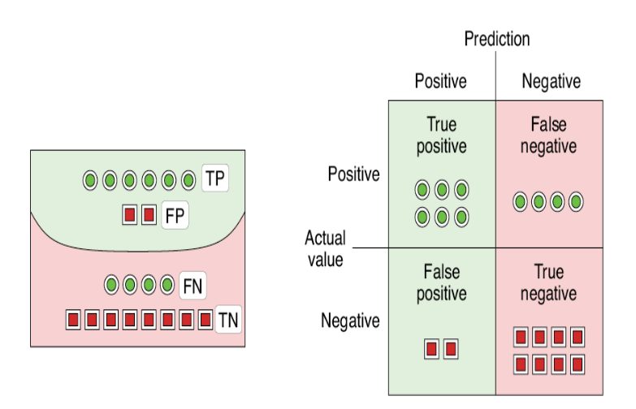
```


---

## Exactitud (accuracy)
        
```{r echo=FALSE, out.width = '90%',  fig.align='center'}
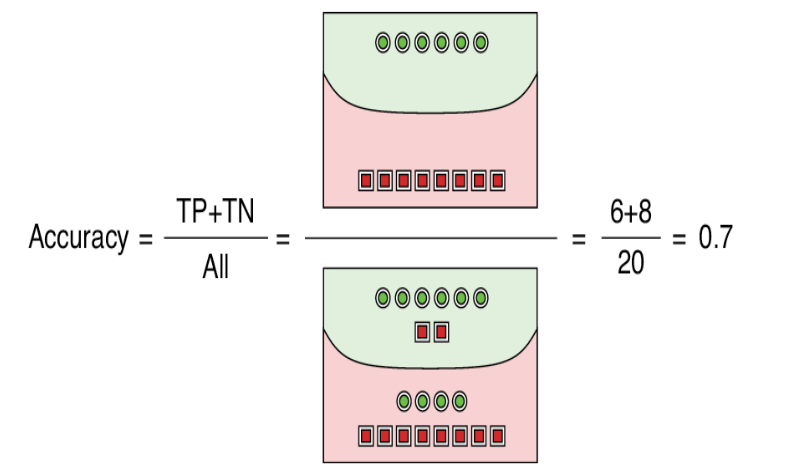
```


---

## Precision

        
```{r echo=FALSE, out.width = '90%',  fig.align='center'}
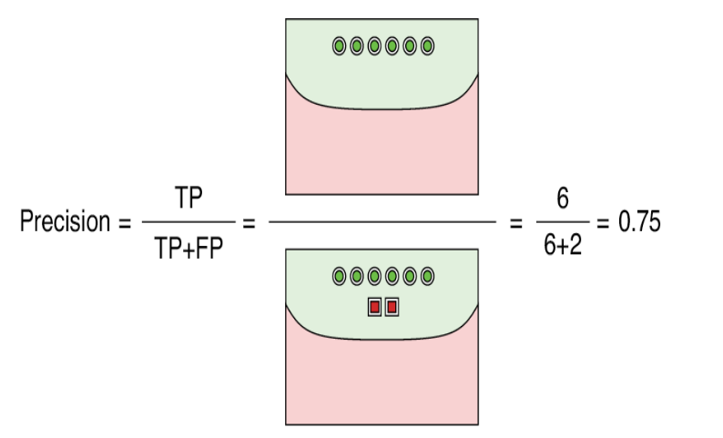
```


---

## Recall

       
```{r echo=FALSE, out.width = '90%',  fig.align='center'}
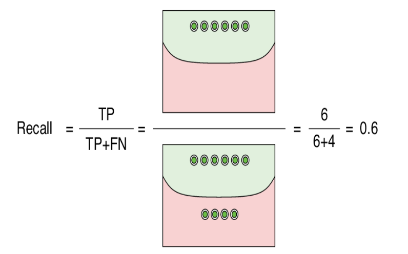
```


---

## Resumiendo

       
```{r echo=FALSE, out.width = '90%',  fig.align='center'}
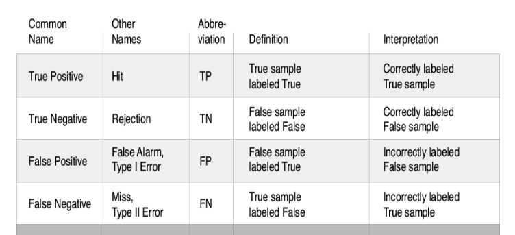
```

---


## Precision vs Recall 

* Uno podria elegir trabajar con las métricas de Precision o Recall para un problema desbalanceado. 
Maximinar la precisión minimizará los FALSOS POSITIVOS, mientras que el Recall minimizará los FALSOS
NEGATIVOS. 
* Entonces, podria ser adecuado trabajar con:

.bg-near-white.b--dark-blue.ba.bw2.br3.shadow-5.ph4.mt2[

#### Precisión: Cuando el objetivo es minimizar los falsos positivos. 


#### Recall: Cuando el objetivo es minimizar los falsos negativos. 


]


---

## F score


La medida F equilibra la precisión y el recall. En algunos problemas, puede que nos interese
en una medida F con más atención puesta en la precisión, como cuando los falsos positivos son más  importante minimizar, pero los falsos negativos siguen siendo importantes. En otros problemas, podríamos estar interesados en una medida F con más atención puesta en el recall, como cuando los falsos negativos son más importantes minimizar, pero los falsos positivos siguen siendo importantes.
La solución es la medida Fbeta (medida F β). 
--
La medida Fbeta es una abstracción de la medida F donde el equilibrio de precisión y recall en el cálculo de la media armónica está controlado por un coeficiente llamado beta (β).


```{r echo=FALSE, out.width = '60%',  fig.align='center'}
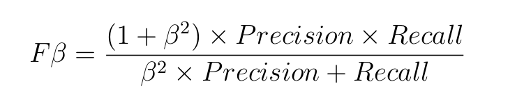
```

* F0.5-measure (β = 0.5): Mayor peso en la **precisión**, menos peso en el recall. 
* F1-measure (β = 1): **Balance del peso en la precisión y el recall**.
* F2-measure (β = 2): Menor peso en la precisión, mas peso en el **recall**.

.footnote[*Imbalanced classification with Python. Jason Brownlee*]

---

## F1 score


**Cuando me interesan tanto los FP como los FN, de igual forma**, voy a utilizar el F1-score. 

<br><br><br>
```{r echo=FALSE, out.width = '80%',  fig.align='center'}

```

.footnote[*https://deepai.org/machine-learning-glossary-and-terms/f-score*]

---

### Entendamos el F1-Score

Supongamos que tenemos una máquina recolectora de frutas, siendo que algunas de ellas están maduras y otras no. 


  
```{r echo=FALSE, out.width = '80%',  fig.align='center'}
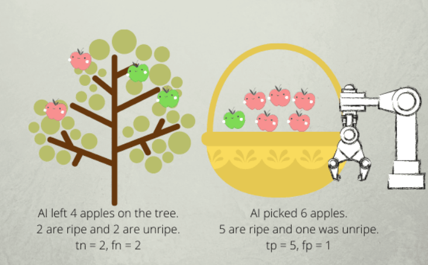
```


.footnote[*https://deepai.org/machine-learning-glossary-and-terms/f-score*]

---


```{r echo=FALSE, out.width = '50%',  fig.align='center'}
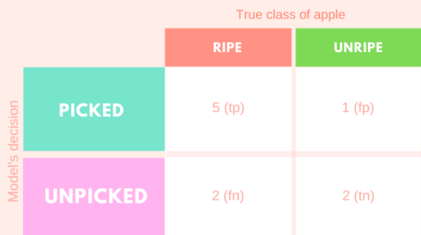
```


```{r echo=FALSE, out.width = '80%',  fig.align='center'}
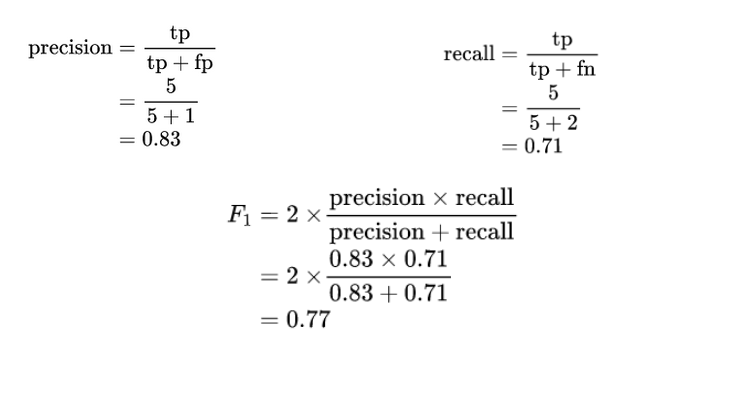
```


.footnote[*https://deepai.org/machine-learning-glossary-and-terms/f-score*]


---

## F2 score

Imaginemos que hemos tenemos un clasificador de mamografías. Lo probamos en una serie de diez mamografías.


```{r echo=FALSE, out.width = '60%',  fig.align='center'}
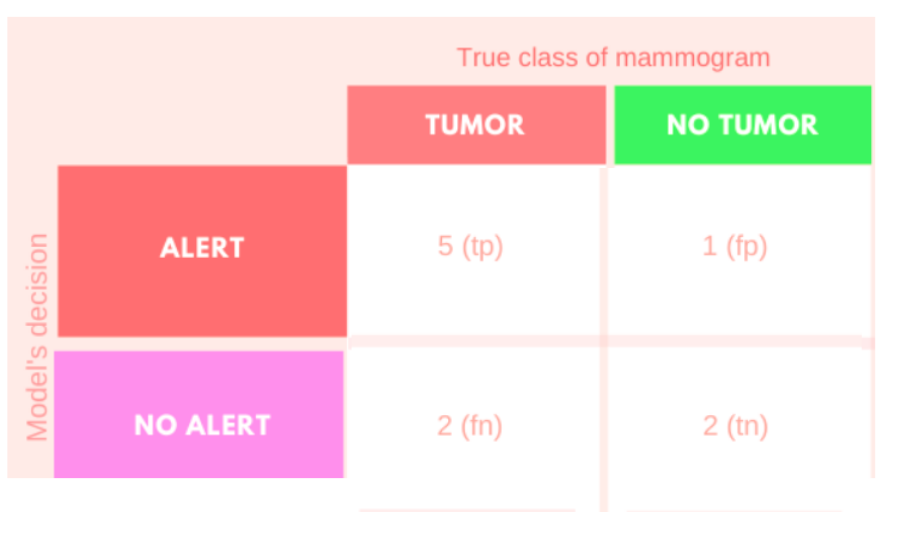
```

---

En una segunda instancia tenemos esta matriz de confusión. 
**Si prestamos atención, los TP y los TN siguen siendo los mismos en ambos casos, pero hubo un cambio en los FP y FN**

```{r echo=FALSE, out.width = '60%',  fig.align='center'}
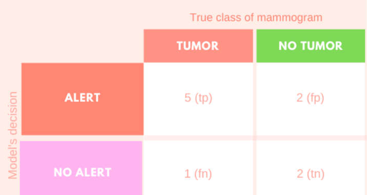
```

--

**¿Qué tipo de error es más grave? ¿Un FP o FN?**

--

Claramente un **FALSO NEGATIVO**, debo poner un énfasis en el **recall**.

---


```{r echo=FALSE, out.width = '90%',  fig.align='center'}
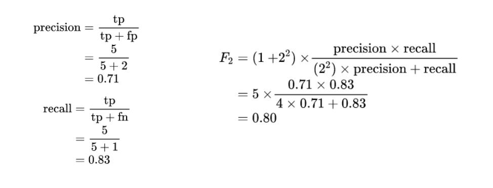
```


---
### Importante  `r emo::ji("bulb")`


.bg-near-white.b--dark-blue.ba.bw2.br3.shadow-5.ph4.mt2[

### La accuracy o exactitud es una métrica apropiada en datasets balanceados. 

### En caso de estar lidiando con datasets desbalanceados deberemos usar la métrica apropiada (o balancear nuestros datos).  

]

.footnote[*https://machinelearningmastery.com/tour-of-evaluation-metrics-for-imbalanced-classification/*]


---

### Importante  `r emo::ji("bulb")`


.bg-near-white.b--dark-blue.ba.bw2.br3.shadow-5.ph4.mt2[

## Determinar que error es más grave (FP o FN) lo determina el contexto de aplicación del problema.

Veamos un ejemplo práctico
]


---

## FP vs FN


```{r echo=FALSE, out.width = '70%',  fig.align='center'}
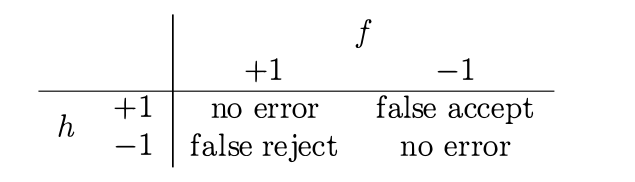
```


Consideremos dos clientes potenciales de un sistema de huellas dactilares. 

* Uno es un **supermercado** que lo usará en el mostrador de pago para verificar que usted es miembro
de un programa de descuento. 
* El otro es la **CIA** que lo usará en la entrada de una instalación, para verificar que Ud es personal autorizado para ingresar a esa instalación.

.footnote[Fuente: *Learning from data*]
---

### FP vs FN


* Para el supermercado, un **falso rechazo (falso negativo) es costoso** porque si un cliente recibe un 
rechazo erróneamente, puede desanimarse de seguir siendo cliente en el futuro. 
* Por otro lado, el costo de una **falsa aceptación (falso positivo) es menor**. El supermercado regala un descuento a alguien que no se lo merecía, sin mayores prejuicios para el supermercado. 


.footnote[Fuente: *Learning from data*]

--


```{r echo=FALSE, out.width = '100%',  fig.align='center'}
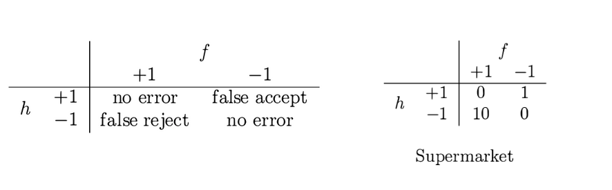
```


.footnote[Fuente: *Learning from data*]

---

### FP vs FN

* Para la CIA, sin embargo, una **falsa aceptación (falso positivo) es un desastre**. Una persona no autorizada se beneficiará del acceso a una instalación muy sensible. 
* **El falso rechazo (falso negativo)**, sin embargo, **puede tolerarse**, ya que las personas autorizadas son empleados (en lugar de clientes como el caso del supermercado).


.footnote[Fuente: *Learning from data*]

--


```{r echo=FALSE, out.width = '100%',  fig.align='center'}
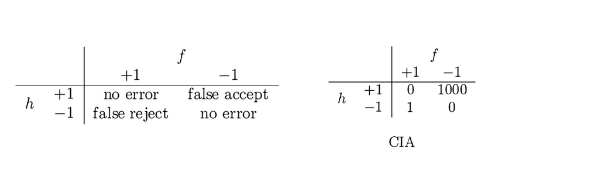
```


.footnote[Fuente: *Learning from data*]


---


## Repaso Curva AUC


.right-column[
**Una curva ROC es apropiada cuando**:
- Quiero ver la performance global del modelo. 
- Quiero comparar diferentes modelos a diferentes thresholds (umbrales).

- Los valores más pequeños en el eje x del gráfico indican menos FP y más TN.
- Los valores más grandes en el eje y del gráfico indican más TP  y menos FN.
]


---

## Curva Precision - Recall 

* La curva de Precision-Recall muestra la compensación entre precisión y recall para diferentes umbrales. Un área alta debajo de la curva representa tanto una alta recall como una alta precisión, donde la alta precisión se relaciona con una tasa baja de falsos positivos y el alto recall se relaciona con una tasa baja de falsos negativos. Los puntajes altos para ambos muestran que el clasificador está arrojando resultados precisos (alta precisión), así como también arroja la mayoría de todos los resultados positivos (alta recall).

* Un sistema con alta recall pero baja precisión arroja muchos resultados, pero la mayoría de las etiquetas previstas son incorrectas en comparación con las etiquetas de entrenamiento. Un sistema con alta precisión pero poca recall es todo lo contrario, arrojando muy pocos resultados, pero la mayoría de las etiquetas predichas son correctas en comparación con las etiquetas de entrenamiento. Un sistema ideal con alta precisión y alta recall devolverá muchos resultados, con todos los resultados etiquetados correctamente.


.footnote[https://scikit-learn.org/stable/auto_examples/model_selection/plot_precision_recall.html]

---

## Curva Precision - Recall

Como podemos ver al aumentar la AUC en clases balanceadas, también aumenta el score en la curva Precision-Recall

 


.footnote[*https://paulvanderlaken.com/2019/08/16/roc-auc-precision-and-recall-visually-explained/*]
---

## Curvas Precision - Recall 

Veamos que sucede con el desbalanceo de clase. 

 

**Como se observa la AUC no se ve casi influenciada por el desbalanceo, lo que nos da una idea que no es una métrica apropiada cuando el desbalanceo de las clases es severo.**


.footnote[*https://paulvanderlaken.com/2019/08/16/roc-auc-precision-and-recall-visually-explained/*]

---

## Quizz 


---

## Tunning de Hiperparámetros

Cuando hacemos tunning de hiperparámetros, lo que hacemos es encontrar valores óptimos para un modelo de regresión o clasificación. 


Esa búsqueda la podemos hacer **en grilla (grid search)** o **random (aleatoria)**
--

```{r echo=FALSE, out.width = '80%',  fig.align='center'}
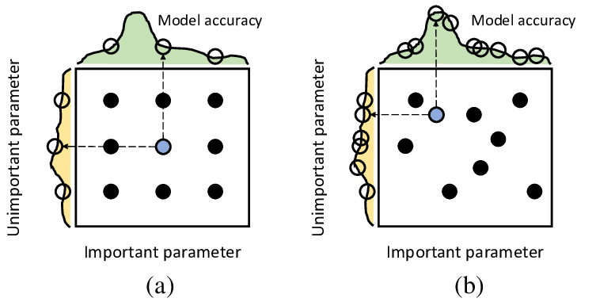
```


---
class: inverse, center, middle 

## Árboles de decisión 

## ¿Cómo se deciden los splits?


---

## Entropía

La entropía es una medida de la aleatoriedad de la información que se procesa. **Cuanto mayor sea la entropía, más difícil será sacar conclusiones de esa información.**

El concepto de entropía viene del campo de la teoría de la información. 


```{r echo=FALSE, out.width = '40%',  fig.align='center'}
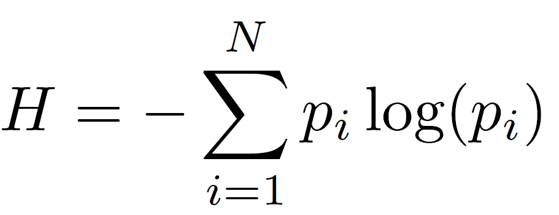
```


```{r echo=FALSE, out.width = '80%',  fig.align='center'}
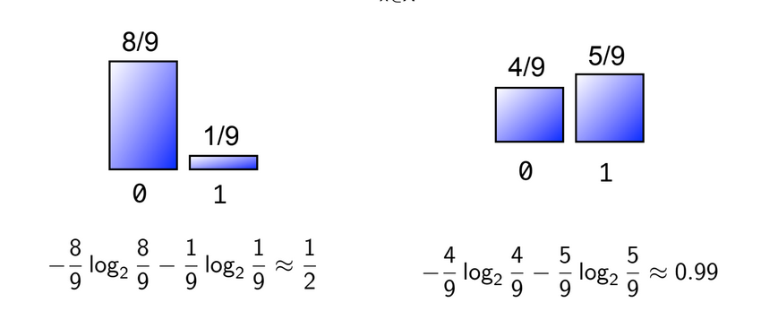
```


---

## Entropía


```{r echo=FALSE, out.width = '80%',  fig.align='center'}
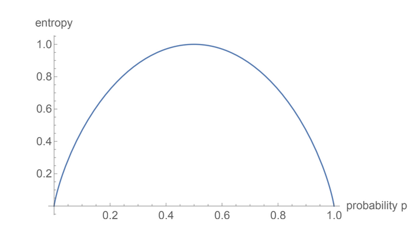
```


--
A partir del gráfico anterior, es bastante evidente que la entropía es cero cuando la probabilidad es 0 o 1. La entropía es máxima cuando la probabilidad es 0.5 porque proyecta una aleatoriedad perfecta en los datos y no hay posibilidad si determinando perfectamente el resultado.


---

### Ganancia de Información (Information Gain)


La ganancia de información es una propiedad estadística que mide qué tan bien un atributo determinado separa los ejemplos de entrenamiento de acuerdo con su clasificación de destino. La construcción de un árbol de decisiones consiste en encontrar un atributo que devuelva la **mayor ganancia de información y la menor entropía.**


$IG = Entropy(parent) - weighted \hspace{1mm} average [Entropy (children)]$


--


```{r echo=FALSE, out.width = '80%',  fig.align='center'}
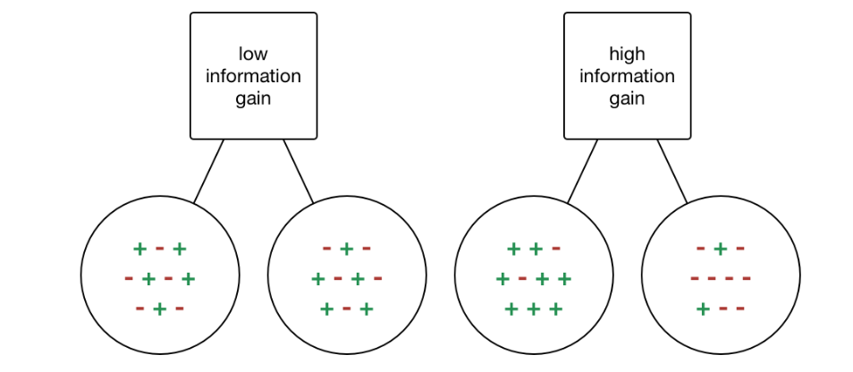
```


---

### Veamos como funciona en un árbol de decisión 

Supongamos que tenemos que decidir si entregar o no un préstamo, y tenemos 2 variables para decidir si lo hacemos:

* Balance:
* Residence:


---


```{r echo=FALSE, out.width = '70%',  fig.align='center'}
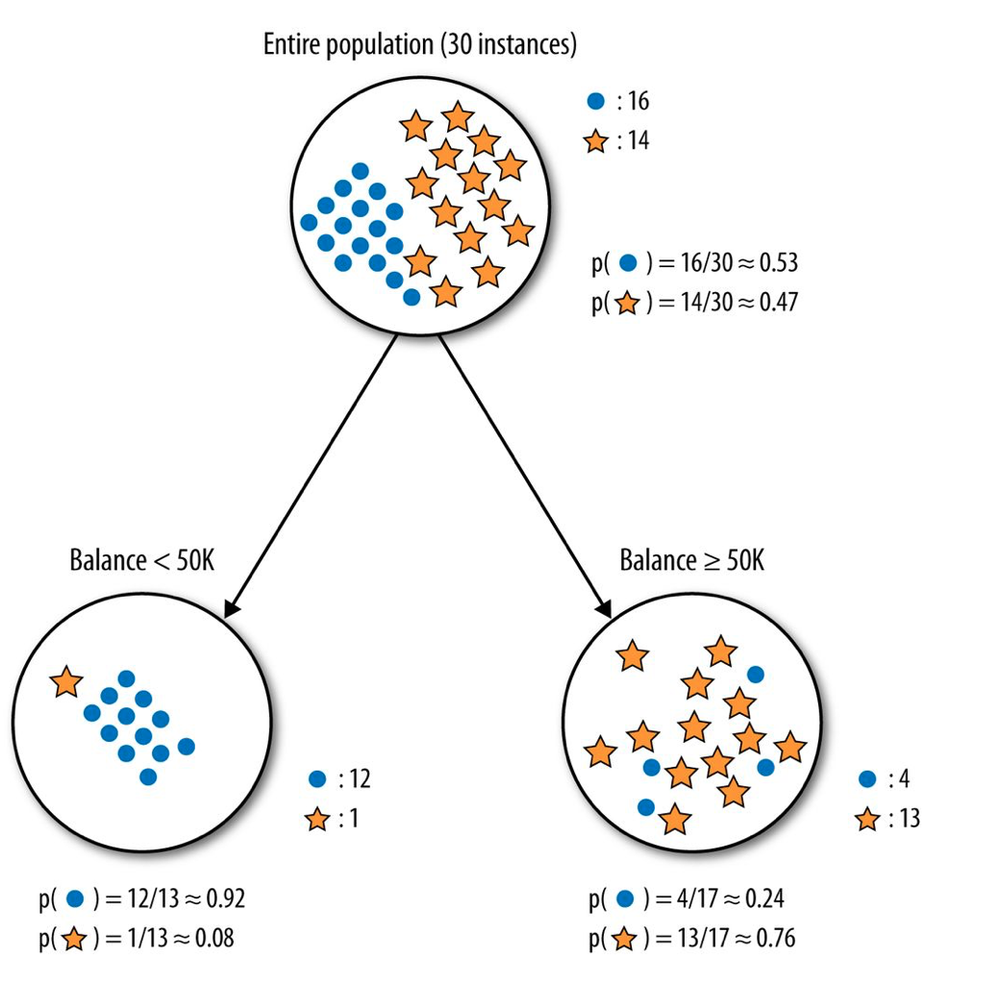
```


---


```{r echo=FALSE, out.width = '70%',  fig.align='center'}

```


---


```{r echo=FALSE, out.width = '90%',  fig.align='center'}
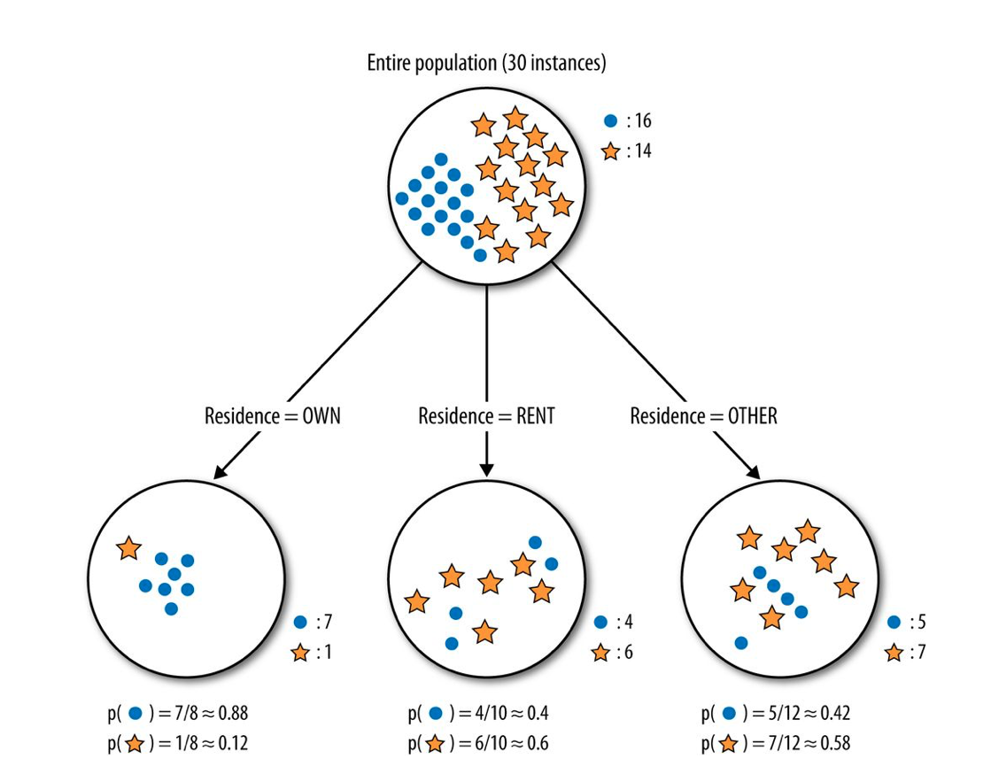
```


---


```{r echo=FALSE, out.width = '80%',  fig.align='center'}

```

---


## Conclusión

Cuanto más homogeneas son las ramas del árbol que se genera al seleccionar el algoritmo una variable, 

* hay mayor ganancia de información.

<br>

* hay menos entropía 

<br><br>

**Eso se traduce en un mejor modelo para la predicción que deseamos realizar**

---

## Relación de Ganancia (Gain Ratio)


---

## Índice de Gini (Index Gini)


---

## Tunning de hiperparámetros en Árboles de decisión 

* Vamos a hacer tunning de los hiperparámetros del modelo. 
Documentación: https://parsnip.tidymodels.org/reference/decision_tree.html 

#### Hiperparámetros del modelo:
<br>
* **cost_complexity**: Un número positivo para el parámetro de costo / complejidad 

<br>
* **tree_depth**: Un número entero para la profundidad máxima del árbol.

<br>
* **min_n**: Un número entero para el número mínimo de puntos de datos en un nodo que se requieren para que el nodo se divida más.


---

## Búsqueda en grilla (grid search)

```{r eval=FALSE, echo=FALSE, message=FALSE, warning=FALSE}
library(tidymodels)
library(tidyverse)
```


```{r eval= FALSE}
set.seed(123) 
trees_spec <- decision_tree() %>% 
  set_engine("rpart") %>% 
  set_mode("classification") %>% 
  set_args(min_n = tune(),
           cost_complexity = tune(),
           tree_depth= tune())
```


---
## Búsqueda random

En **set_args()** voy a especificar los hiperparámetros y dejarlos variar libremente con la funcion tune().


```{r eval= FALSE}
set.seed(123) 
trees_spec <- decision_tree() %>% 
  set_engine("rpart") %>% 
  set_mode("classification") %>% 
  set_args(min_n = tune(),
           cost_complexity = tune(),
           tree_depth= tune())
```


---

## Búsqueda en grilla


```{r}

```

---

class: inverse, center, middle

## Manos en R!


---


class: inverse, center, middle

## Ensembles


---
