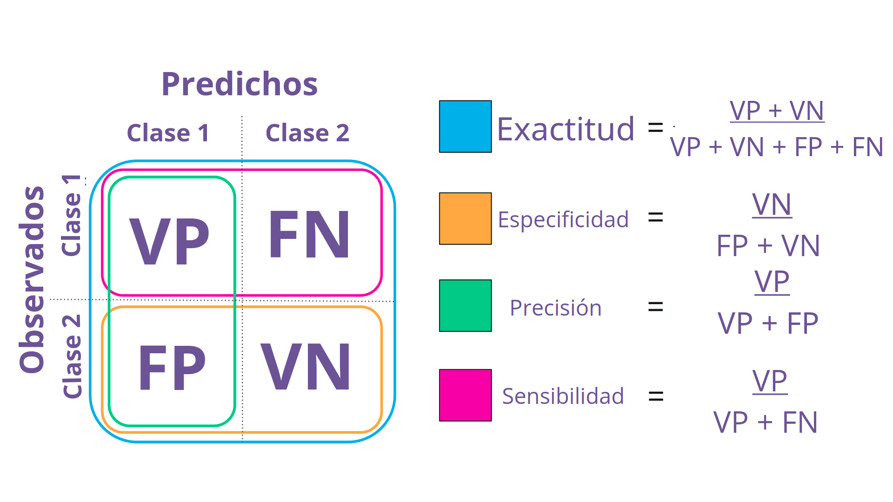
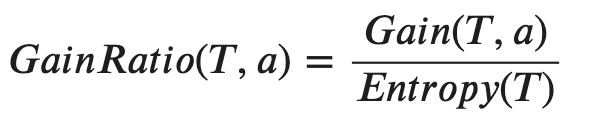

---
output:
  xaringan::moon_reader:
    lib_dir: libs
    css: xaringan-themer.css
    nature:
      highlightStyle: github
      highlightLines: true
      countIncrementalSlides: false
---

background-image: url(img/portada-flacso.png)
background-size: cover
class: animated slideInRight fadeOutLeft, middle

```{r xaringan-extra-styles, include=FALSE}
xaringanExtra::use_extra_styles(
  hover_code_line = TRUE,         #<<
  mute_unhighlighted_code = TRUE  #<<
)
```


```{r , echo=FALSE}
xaringanExtra::use_tachyons()
xaringanExtra::use_panelset()
```


```{r include=FALSE}
library(countdown)
```

```{r setup, include=FALSE}
options(htmltools.dir.version = FALSE)
```

```{r xaringan-themer, include=FALSE, warning=FALSE}
library(xaringanthemer)
#style_duo_accent(
#  primary_color = "#23395b",
#  secondary_color = "#23395b",
#  inverse_header_color = "#FFFFFF"
#)

style_duo_accent(
  header_font_google = google_font("Roboto", "500"),
  text_font_google   = google_font("Roboto", "400", "300i"),
  code_font_google   = google_font("Roboto")
)
```


```{r, message=FALSE, warning=FALSE, include=FALSE}
style_mono_accent(base_color = "#43418A")
```

```{r , message=FALSE, warning=FALSE, include=FALSE} 
library(fontawesome)
library(emo)
```


```{r xaringan-logo, echo=FALSE}
#xaringanExtra::use_fit_screen()
#xaringanExtra::use_logo("img/logo-tidymodels.png")
```


```{r xaringan-tachyons, echo=FALSE}
xaringanExtra::use_tachyons()
xaringanExtra::use_fit_screen()
```


# Machine Learning en Aplicaciones Espaciales


### Clase 2a


---

## Hoja de Ruta

#### Intro teórica

* Principios del aprendizaje

* Repaso de Métricas (F1 score / AUC Curva / Precision - Recall Curva)

* Árboles de decisión (Tunning)

--

#### Práctica guiada

--

#### Recreo  `r emo::ji("tea")`

--

#### Manos en R! `r emo::ji("computer")`

--

#### Ensembles. Introducción a Random Forest


---

class: inverse, center, middle

## Principios del aprendizaje


---

### 1. Navaja de Occam `r emo::ji("hocho")`


.bg-near-white.b--purple.ba.bw2.br3.shadow-5.ph4.mt5[

### El modelo más simple que pueda ser ajustado es el más factible.

#### Si tuviéramos para elegir entre un modelo simple y uno complejo con el mismo desempeño, debo preferir **siempre** el modelo más simple
]


.footnote[__Learning from data__ Abu-Mostafa, Y.]

---

## Occam y Principio de Parsimonia


        
```{r echo=FALSE, out.width = '90%',  fig.align='center'}

```


.footnote[Fuente: https://pedromdd.medium.com/ten-myths-about-machine-learning-d888b48334a3]
---


### 2. Bias en el muestreo (sampling bias)


.bg-near-white.b--purple.ba.bw2.br3.shadow-5.ph4.mt5[

### Si los datos contienen un sesgo, el algoritmo tendrá ese mismo sesgo.
]


.footnote[__Learning from data__ Abu-Mostafa, Y.]

---


### 3. Data snooping  `r emo::ji("eyes")`

.bg-near-white.b--purple.ba.bw2.br3.shadow-5.ph4.mt5[

### El set de datos de testeo no debe usarse nunca durante la fase de entrenamiento, ya que esto arrojará resultados más optimistas que los esperados. 
]

.footnote[__Learning from data__ Abu-Mostafa, Y.]

---
class: inverse, center, middle

# Repaso de Métricas

---

## MAE (Error absoluto medio)


```{r echo=FALSE, out.width = '70%',  fig.align='center'}
knitr::include_graphics("img/mae-n.jpg")
```


Es la media de la diferencia absoluta entre el valor observado y los valores predichos. 
El error absoluto medio o MAE es un puntaje lineal, lo que significa que todas las diferencias individuales se ponderán por igual en el promedio. Por ejemplo, la diferencia entre 10 y 0 será el doble de la diferencia entre 5 y 0.


---

## MSE (Error cuadrático medio)


```{r echo=FALSE, out.width = '60%',  fig.align='center'}
knitr::include_graphics("img/mse.jpg")
```


---

## RSME (Raiz del error cuadrático medio)


```{r echo=FALSE, out.width = '40%',  fig.align='center'}
knitr::include_graphics("img/rmse.png")
```


---


## Matriz de confusión

        
```{r echo=FALSE, out.width = '90%',  fig.align='center'}
knitr::include_graphics("img/conf-m.png")
```


---

## Exactitud (accuracy)
        
```{r echo=FALSE, out.width = '90%',  fig.align='center'}

```


---

## Precision

        
```{r echo=FALSE, out.width = '90%',  fig.align='center'}

```


---

## Recall

       
```{r echo=FALSE, out.width = '90%',  fig.align='center'}
knitr::include_graphics("img/conf-m4.png")
```


---

## Resumiendo

       
```{r echo=FALSE, out.width = '90%',  fig.align='center'}
knitr::include_graphics("img/metrics00.png")
```

---

## Para recordar mejor


       
```{r echo=FALSE, out.width = '90%',  fig.align='center'}

```


.footnote[Fuente: *https://chrisalbon.com/*]


---


## Precision vs Recall 

* Uno podria elegir trabajar con las métricas de Precision o Recall para un problema desbalanceado. 
Maximinar la precisión minimizará los FALSOS POSITIVOS, mientras que el Recall minimizará los FALSOS
NEGATIVOS. 
* Entonces, podria ser adecuado trabajar con:

.bg-near-white.b--dark-blue.ba.bw2.br3.shadow-5.ph4.mt2[

#### Precisión: Cuando el objetivo es minimizar los falsos positivos. 


#### Recall: Cuando el objetivo es minimizar los falsos negativos. 


]


---

## F score


La medida F equilibra la precisión y el recall. En algunos problemas, puede que nos interese
en una medida F con más atención puesta en la precisión, como cuando los falsos positivos son más  importante minimizar, pero los falsos negativos siguen siendo importantes. En otros problemas, podríamos estar interesados en una medida F con más atención puesta en el recall, como cuando los falsos negativos son más importantes minimizar, pero los falsos positivos siguen siendo importantes.
La solución es la medida Fbeta (medida F β). 
--
La medida Fbeta es una abstracción de la medida F donde el equilibrio de precisión y recall en el cálculo de la media armónica está controlado por un coeficiente llamado beta (β).


```{r echo=FALSE, out.width = '60%',  fig.align='center'}

```

* F0.5-measure (β = 0.5): Mayor peso en la **precisión**, menos peso en el recall. 
* F1-measure (β = 1): **Balance del peso en la precisión y el recall**.
* F2-measure (β = 2): Menor peso en la precisión, mas peso en el **recall**.

.footnote[*Imbalanced classification with Python. Jason Brownlee*]

---

## F1 score


**Cuando me interesan tanto los FP como los FN, de igual forma**, voy a utilizar el F1-score. 

<br><br><br>
```{r echo=FALSE, out.width = '80%',  fig.align='center'}

```

.footnote[*https://deepai.org/machine-learning-glossary-and-terms/f-score*]

---

### Entendamos el F1-Score

Supongamos que tenemos una máquina recolectora de frutas, siendo que algunas de ellas están maduras y otras no. 


  
```{r echo=FALSE, out.width = '80%',  fig.align='center'}
knitr::include_graphics("img/ripe-apples.png")
```


.footnote[*https://deepai.org/machine-learning-glossary-and-terms/f-score*]

---


```{r echo=FALSE, out.width = '50%',  fig.align='center'}
knitr::include_graphics("img/apple-ripe2.png")
```


```{r echo=FALSE, out.width = '80%',  fig.align='center'}

```


.footnote[*https://deepai.org/machine-learning-glossary-and-terms/f-score*]


---

## F2 score

Imaginemos que hemos tenemos un clasificador de mamografías. Lo probamos en una serie de diez mamografías.


```{r echo=FALSE, out.width = '60%',  fig.align='center'}
knitr::include_graphics("img/mamm1.png")
```

---

En una segunda instancia tenemos esta matriz de confusión. 
**Si prestamos atención, los TP y los TN siguen siendo los mismos en ambos casos, pero hubo un cambio en los FP y FN**

```{r echo=FALSE, out.width = '60%',  fig.align='center'}
knitr::include_graphics("img/f2-mammogram.png")
```

--

**¿Qué tipo de error es más grave? ¿Un FP o FN?**

--

Claramente un **FALSO NEGATIVO**, debo poner un énfasis en el **recall**.

---


```{r echo=FALSE, out.width = '90%',  fig.align='center'}

```


---
### Importante  `r emo::ji("bulb")`


.bg-near-white.b--dark-blue.ba.bw2.br3.shadow-5.ph4.mt2[

### La accuracy o exactitud es una métrica apropiada en datasets balanceados. 

### En caso de estar lidiando con datasets desbalanceados deberemos usar la métrica apropiada (o balancear nuestros datos).  

]

.footnote[*https://machinelearningmastery.com/tour-of-evaluation-metrics-for-imbalanced-classification/*]


---


## Repaso Curva AUC


.bg-near-white.b--dark-blue.ba.bw2.br3.shadow-5.ph4.mt2[

**Una curva ROC es apropiada cuando**:
- Quiero ver la performance global del modelo. 
- Quiero comparar diferentes modelos a diferentes thresholds (umbrales).

- Los valores más pequeños en el eje x del gráfico indican menos FP y más TN.
- Los valores más grandes en el eje y del gráfico indican más TP  y menos FN.

]


---

 
```{r echo=FALSE, out.width = '80%',  fig.align='center'}

```


* Teniendo en mente el eje X y Y de la curva ROC, nuestro foco está en el TPR, el recall o la sensibilidad, y en el False Positive Rate, o también 1-Especificidad. 


mientras que en la **curva Precision-Recall**:

* Precision
* Recall (Sensibilidad)

**De cierta forma, me esta interesando una sola clase, la clase positiva.** 


---

## Curva Precision - Recall 

* La curva de Precision-Recall muestra la compensación entre **precisión y recall para diferentes umbrales**. Un área alta debajo de la curva representa tanto una alta recall como una alta precisión, donde la alta precisión se relaciona con una tasa baja de falsos positivos y el alto recall se relaciona con una tasa baja de falsos negativos. Los puntajes altos para ambos muestran que el clasificador está arrojando resultados precisos (alta precisión), así como también arroja la mayoría de todos los resultados positivos (alta recall).

* **Un sistema con alta recall** pero baja precisión arroja muchos resultados, pero la mayoría de las etiquetas previstas son incorrectas en comparación con las etiquetas de entrenamiento. 

* **Un sistema con alta precisión** pero poca recall es todo lo contrario, arrojando muy pocos resultados, pero la mayoría de las etiquetas predichas son correctas en comparación con las etiquetas de entrenamiento. 

* **Un sistema ideal con alta precisión y alta recall** devolverá muchos resultados, con todos los resultados etiquetados correctamente.


.footnote[https://scikit-learn.org/stable/auto_examples/model_selection/plot_precision_recall.html]

---

## Curva Precision - Recall

Como podemos ver al aumentar la AUC en clases balanceadas, también aumenta el score en la curva Precision-Recall

 


.footnote[*https://paulvanderlaken.com/2019/08/16/roc-auc-precision-and-recall-visually-explained/*]
---

## Curvas Precision - Recall 

Veamos que sucede con el desbalanceo de clase. 

 

**Como se observa la AUC no se ve casi influenciada por el desbalanceo, lo que nos da una idea que no es una métrica apropiada cuando el desbalanceo de las clases es severo.**


.footnote[*https://paulvanderlaken.com/2019/08/16/roc-auc-precision-and-recall-visually-explained/*]

---

class: inverse, central, middle


## Bias-Variance Tradeoff


---

## Espacio de hipótesis

f: la funcion verdadera a estimar

g: la mejor función que puedo obtener mediante diferentes modelos

g{D1}, g{D2}, g{D3}: son las funciones que obtengo ajustando mediante un dataset


```{r echo=FALSE, out.width = '70%',  fig.align='center'}

```


.footnote[Fuente: https://blog.insightdatascience.com/bias-variance-tradeoff-explained-fa2bc28174c4]


---

## Matemáticamente


```{r echo=FALSE, out.width = '100%',  fig.align='center'}

```


.footnote[Fuente: https://github.com/AntonMu/BiasVarianceTradeoff/blob/master/Bias_Variance_Tradeoff.pdf]


---

class: inverse, center, middle


## ¿Cómo puedo controlar la complejidad de mi modelo?


---

class: inverse, center, middle


## Recordar
--

## La complejidad está determinada mediante:
--

## Parámetros

--

## Hiperparámetros

---

class: inverse, center, middle


## Pero sólo sobre los hiperparámetros voy a tener CONTROL

--

## ¿Cómo?

---

## Tunning de Hiperparámetros

Cuando hacemos tunning de hiperparámetros, lo que hacemos es encontrar valores óptimos para un modelo de regresión o clasificación. 


Esa búsqueda la podemos hacer **en grilla (grid search)** o **random (aleatoria)**
--

```{r echo=FALSE, out.width = '80%',  fig.align='center'}

```


---

class: inverse, center, middle


## ¿Cómo queda nuestro flujo de trabajo?


---

## Flujo de trabajo


```{r echo=FALSE, out.width = '100%',  fig.align='center'}

```


---
## Tunning de hiperparámetros en Árboles de decisión 

* Vamos a hacer tunning de los hiperparámetros del modelo. 
Documentación: https://parsnip.tidymodels.org/reference/decision_tree.html 

 Hiperparámetros del modelo:


.bg-near-white.b--dark-blue.ba.bw2.br3.shadow-5.ph4.mt2[
* **cost_complexity**: Un número positivo para el parámetro de costo / complejidad 

* **tree_depth**: Un número entero para la profundidad máxima del árbol.

* **min_n**: Un número entero para el número mínimo de puntos de datos en un nodo que se requieren para que el nodo se divida más.

]


---

### Valores por defecto


```{r echo=FALSE, out.width = '90%',  fig.align='center'}

```

.bg-near-white.b--dark-blue.ba.bw2.br3.shadow-5.ph4.mt2[

* **Cuando aumenta el tree_depth aumenta la probabilidad de overfitting**

* **Cuando disminuye el min_n aumenta la probabilidad de overfitting**

* **Cuando se acerca a 0 el cost_complexity, aumenta la probabilidad de overfitting**

]


---
class: inverse, center, middle 

## Árboles de decisión 

### ¿Cómo se deciden los splits?


---

## Entropía

La entropía es una medida de la aleatoriedad de la información que se procesa. **Cuanto mayor sea la entropía, más difícil será sacar conclusiones de esa información.**

El concepto de entropía viene del campo de la teoría de la información. 


```{r echo=FALSE, out.width = '40%',  fig.align='center'}

```


```{r echo=FALSE, out.width = '80%',  fig.align='center'}
knitr::include_graphics("img/entropy2.png")
```


---

## Entropía


```{r echo=FALSE, out.width = '80%',  fig.align='center'}
knitr::include_graphics("img/shannon.png")
```


--
A partir del gráfico anterior, es bastante evidente que la entropía es cero cuando la probabilidad es 0 o 1. La entropía es máxima cuando la probabilidad es 0.5 porque proyecta una aleatoriedad perfecta en los datos y no hay posibilidad si determinando perfectamente el resultado.


---

### Ganancia de Información (Information Gain)


La ganancia de información es una propiedad estadística que mide qué tan bien un atributo determinado separa los ejemplos de entrenamiento de acuerdo con su clasificación de destino. La construcción de un árbol de decisiones consiste en encontrar un atributo que devuelva la **mayor ganancia de información y la menor entropía.**


$IG = Entropy(parent) - weighted \hspace{1mm} average [Entropy (children)]$


--


```{r echo=FALSE, out.width = '80%',  fig.align='center'}
knitr::include_graphics("img/IG.png")
```


---

### Veamos como funciona en un árbol de decisión 

Supongamos que tenemos que decidir si entregar o no un préstamo, y tenemos 2 variables para decidir si lo hacemos:

* Balance:
* Residence:


---


```{r echo=FALSE, out.width = '70%',  fig.align='center'}
knitr::include_graphics("img/entropy-balance.png")
```


---


```{r echo=FALSE, out.width = '70%',  fig.align='center'}
knitr::include_graphics("img/entrop-balance.png")
```


---


```{r echo=FALSE, out.width = '90%',  fig.align='center'}
knitr::include_graphics("img/entropy-residence.png")
```


---


```{r echo=FALSE, out.width = '80%',  fig.align='center'}
knitr::include_graphics("img/entrop-residenc.png")
```

---


## Conclusión

Cuanto más homogeneas son las ramas del árbol que se genera al seleccionar el algoritmo una variable, 

.bg-near-white.b--dark-blue.ba.bw2.br3.shadow-5.ph4.mt2[

* **hay mayor ganancia de información.**

* **hay menos entropía**

]


**Eso se traduce en un mejor modelo para la predicción que deseamos realizar**


---

## Relación de Ganancia (Gain Ratio)


La relación de Ganancia (Gain Ratio) es el cociente entre la ganancia de información (Information Gain) y la entropía del nodo raíz (root node). 


```{r echo=FALSE, out.width = '90%',  fig.align='center'}

```


---

## Índice de Gini (Index Gini)


```{r echo=FALSE, out.width = '50%',  fig.align='center'}
knitr::include_graphics("img/gini.png")
```


---

class: inverse, center, middle

## Manos en R!


---

## Bibliografía


* Learning from data. 

* Applied Predictive Modeling.

* Rashka, Sebastian. https://www.youtube.com/watch?v=z2n8kHXkwtM 
