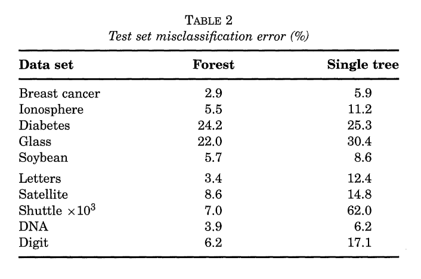

---
output:
  xaringan::moon_reader:
    lib_dir: libs
    css: xaringan-themer.css
    nature:
      highlightStyle: github
      highlightLines: true
      countIncrementalSlides: false
---

background-image: url(img/portada-flacso.png)
background-size: cover
class: animated slideInRight fadeOutLeft, middle

```{r xaringan-extra-styles, include=FALSE}
xaringanExtra::use_extra_styles(
  hover_code_line = TRUE,         #<<
  mute_unhighlighted_code = TRUE  #<<
)
```


```{r , echo=FALSE}
xaringanExtra::use_tachyons()
xaringanExtra::use_panelset()
```


```{r include=FALSE}
library(countdown)
```

```{r setup, include=FALSE}
options(htmltools.dir.version = FALSE)
```

```{r xaringan-themer, include=FALSE, warning=FALSE}
library(xaringanthemer)
#style_duo_accent(
#  primary_color = "#23395b",
#  secondary_color = "#23395b",
#  inverse_header_color = "#FFFFFF"
#)

style_duo_accent(
  header_font_google = google_font("Roboto", "500"),
  text_font_google   = google_font("Roboto", "400", "300i"),
  code_font_google   = google_font("Roboto")
)
```


```{r, message=FALSE, warning=FALSE, include=FALSE}
style_mono_accent(base_color = "#43418A")
```

```{r , message=FALSE, warning=FALSE, include=FALSE} 
library(fontawesome)
library(emo)
```


```{r xaringan-logo, echo=FALSE}
#xaringanExtra::use_fit_screen()
#xaringanExtra::use_logo("img/logo-tidymodels.png")
```


```{r xaringan-tachyons, echo=FALSE}
xaringanExtra::use_tachyons()
xaringanExtra::use_fit_screen()
```


# Machine Learning en Aplicaciones Espaciales


### Clase 2b: Introducción a ensembles. Random Forest 


---


## Ensembles


Con el nombre de ensembles se conocen a los modelos de:

.bg-near-white.b--purple.ba.bw2.br3.shadow-5.ph4.mt4[

* **Variedades de Bagging** (Bagged Trees, Random Forest, Extra Trees)

* **Variedades de Boosting** (Adaboost, XGBoost)


]


--

La idea es combinar modelos simples (árboles de decisión) para lograr **una mejor predicción**.

--

Usados en regresión y clasificación.

---

## Bias y Varianza en árboles de decisión


.bg-near-white.b--purple.ba.bw2.br3.shadow-5.ph3.mt4[
Por lo general, 
* **los árboles pequeños (pocas ramificaciones) tienen poca varianza pero no consiguen representar bien la relación entre las variables, es decir, tienen bias alto**. En contraposición, 

* **los árboles grandes se ajustan mucho a los datos de entrenamiento, por lo que tienen muy poco bias pero mucha varianza**. Una forma de solucionar este problema son los métodos de ensemble.
]


* Los **métodos de ensemble** combinan múltiples modelos en uno nuevo con el objetivo de **lograr un equilibro entre bias y varianza**, consiguiendo así mejores predicciones que cualquiera de los modelos individuales originales.

---

class: inverse, center, middle

## Bagging 

--

## = 

--

## Boostrap aggregation

## (muestreo con reemplazo)


---

### ¿Por qué bagging?


```{r echo=FALSE, out.width = '90%',  fig.align='center'}

```

El boostrapping o bagging introduce mayor diversidad en los subsets de datos en los que cada predictor es entrenado, lo que trae como conseucencia que el bias sea más alto que si no se hiciese bagging. Esto significa que el predictor termina siendo menos correlacionado, entonces la varianza del ensemble se reduce. En general, el bagging resulta en mejores modelos, lo que explica porque se lo prefiere a árboles de decisión. 


.footnote[Fuente: *Hands on Machine Learning with scikit-learn and Tensorflow*]

---

## Bias y varianza en bagging / boosting


.bg-near-white.b--purple.ba.bw2.br3.shadow-5.ph4.mt3[
###  En *bagging*, se emplean **modelos con muy poco bias pero mucha varianza**, agregándolos se consigue reducir la varianza sin apenas aumentar el bias. 
###  En *boosting*, se emplean **modelos con muy poca varianza pero mucho bias**, ajustando secuencialmente los modelos se reduce el bias. Por lo tanto, cada una de las estrategias reduce una parte del error total.

]


---

## Bagging para clasificación

* También llamado *bootstrap resampling*. 


.left-column[
```{r echo=FALSE, out.width = '400%',  fig.align='center'}
knitr::include_graphics("img/bagging0.svg")
```


]

.right-column[

```{r echo=FALSE, out.width = '100%',  fig.align='center'}
knitr::include_graphics("img/bagging.svg")
```

]


---
## Bagging para clasificación

.left-column[
```{r echo=FALSE, out.width = '100%',  fig.align='center'}
knitr::include_graphics("img/bagging0.svg")
```


]

.right-column[

```{r echo=FALSE, out.width = '200%',  fig.align='center'}
knitr::include_graphics("img/bagging_line.svg")
```


```{r echo=FALSE, out.width = '200%',  fig.align='center'}
knitr::include_graphics("img/bagging_trees.svg")
```


]


---

## Bagging para clasificación


.left-column[
```{r echo=FALSE, out.width = '100%',  fig.align='center'}
knitr::include_graphics("img/bagging0_cross.svg")
```


]

.right-column[

```{r echo=FALSE, out.width = '120%',  fig.align='center'}
knitr::include_graphics("img/bagging_cross.svg")
```


```{r echo=FALSE, out.width = '120%',  fig.align='center'}
knitr::include_graphics("img/bagging_trees_predict.svg")
```


```{r echo=FALSE, out.width = '120%',  fig.align='center'}
knitr::include_graphics("img/bagging_vote.svg")
```


]


---


## Baggging para regresión


.left-column[
```{r echo=FALSE, out.width = '100%',  fig.align='center'}

```


]

.right-column[

```{r echo=FALSE, out.width = '120%',  fig.align='center'}
knitr::include_graphics("img/bagging_reg_grey.svg")
```


```{r echo=FALSE, out.width = '120%',  fig.align='center'}

```

Promediamos


```{r echo=FALSE, out.width = '40%',  fig.align='center'}
knitr::include_graphics("img/bagging_reg_blue.svg")
```
]


---

## Algoritmo de Bagging


```{r echo=FALSE, out.width = '100%',  fig.align='center'}

```


.footnote[Fuente: *Max Kuhn. Applied Predictive Modeling*]

---

## Random Forest

Los métodos de random forest y bagging siguen el mismo algoritmo con la única diferencia de que, en random forest, **antes de cada división, se seleccionan aleatoriamente m predictores**. La diferencia en el resultado dependerá del valor m escogido. 

* Si **m=p**, los resultados de random forest y bagging son equivalentes. 

* Para *clasificación*, por defecto, el valor de m, es la raíz cuadrada del número total de predictores. **m = sqrt(p)**

* Para *regresión*, el valor por defecto de m, es un tercio del número de predictores. **m = p/3**

Si los predictores están muy correlacionados, valores pequeños de m, consiguen mejores resultados. En la práctica, tuneamos el valor de **m** con **mtry**. 

---

## ¿Cómo sucede esto?

* Supongamosque hay un predictor muy bueno en el conjunto de datos, junto con otros varios predictores moderadamente buenos. Luego en la colección de *bagged trees*, la mayoría o todos los árboles utilizarán este potente conjunto de predictores para realizar los splits. 

--
En consecuencia, todos los *bagged trees* se verán bastante similares entre sí. **Por lo tanto, las predicciones de los árboles en bolsas estarán altamente correlacionadas.** Desafortunadamente, promediar muchas cantidades altamente correlacionadas no conduce a una reducción en la varianza tan grande como promediar muchas cantidades no correlacionadas.  En particular, esto significa que el bagging no dará lugar a una reducción de la varianza sobre un solo árbol en este entorno.

--

* *Random Forest* superan este problema obligando a cada división a considerar solo un subconjunto de los predictores. Por lo tanto, en promedio (p - m) / p de las divisiones ni siquiera considerarán el predictor fuerte, por lo que otros predictores tendrá más posibilidades. **Podemos pensar en este proceso como una decorrelación los árboles**, lo que hace que el promedio de los árboles resultantes sea menos variable
y por lo tanto más confiable.
La principal diferencia entre *bagged trees* y *random forest* es la elección del tamaño del subconjunto de predictores m.


---
## Retomando 

.bg-near-white.b--purple.ba.bw2.br3.shadow-5.ph3.mt4[
### Bagging es una estrategia general para cualquier tipo de modelo. 


### En Random Forest, en particular, aparte de bagging, hago un sampling de variables, que me permite reducir la varianza y obtener mejores predicciones. 
]


---

## Esquema de Random Forest


```{r echo=FALSE, out.width = '90%',  fig.align='center'}
knitr::include_graphics("img/random-forest.png")
```


---

## Random Forest vs Árboles de Decisión

* Train: 90%
* Test: 10%

```{r echo=FALSE, out.width = '70%',  fig.align='center'}

```


.footnote[Fuente: *Leo Breiman. Statistical Modeling: The two cultures*]

---

## Out-of-Bag error

* El hecho de que los árboles se ajusten empleando muestras generadas por bootstrapping conlleva que, en promedio, cada ajuste use solo aproximadamente dos tercios de las observaciones originales. Al tercio restante se le llama out-of-bag (OOB).


--

* Si para cada árbol ajustado en el proceso de bagging se registran las observaciones empleadas, se puede predecir la respuesta de la observación i haciendo uso de aquellos árboles en los que esa observación ha sido excluida y promediándolos (la moda en el caso de los árboles de clasificación). Siguiendo este proceso, se pueden obtener las predicciones para las n observaciones y con ellas calcular el **OOB-mean square error (para regresión)** o el **OOB-classification error (para árboles de clasificación)**. 


---

## Limitaciones del out-of-bag error


.bg-near-white.b--purple.ba.bw2.br3.shadow-5.ph4.mt5[

* No adecuado para datos que guardan una relación temporal (series temporales).

* El preprocesado de los datos de entrenamiento se hace de forma conjunta, por lo que las observaciones out-of-bag pueden sufrir data leakage. De ser así, las estimaciones del OOB-error son demasiado optimistas.

]


---
## Random Forest


.bg-near-white.b--purple.ba.bw2.br3.shadow-5.ph4.mt5[
### Random Forest es un algoritmo sencillo, fácil de implementar, fácil de usar y requiere tunning de pocos hiperparámetros. 
### A diferencia de Árboles de Decisión puede ser menos interpretable. 

]


---

## Algoritmo de Random Forest


```{r echo=FALSE, out.width = '100%',  fig.align='center'}

```


.footnote[Fuente: *Max Kuhn. Applied Predictive Modeling*]


---


## Tunning en Random Forest en R


```{r echo=FALSE, out.width = '90%',  fig.align='center'}

```


.footnote[Fuente: https://parsnip.tidymodels.org/reference/rand_forest.html]


---

## Extra Trees

* Extra Trees = Extremely Randomized Trees

Cuando crece un árbol en un Random Forest, en cada nodo solo una parte aleatoria de los features es considerada para el split. **Es posible hacer los árboles aún más aleatorios usando umbrales aleatorios para cada feature (variable) en vez de buscar los mejores posibles umbrales (como se hace en árboles de decisión).** 

Un árbol de árboles tan aleatorios, simplemente se los llama **Extremely Randomized trees** o ExtraTrees. De vuelta, esto intercambia más bias por menos varianza. Esto hace que los ExtraTrees **más rápidos de entrenar que Random Forests** ya que encontrar el mejor umbral posible para cada feature a cada nodo es la tarea más cara computacionalmente. 


.footnote[Fuente: Hands on Machine learning with scikit-learn and Tensorflow]


---

## Extra Trees


```{r echo=FALSE, out.width = '100%',  fig.align='center'}

```


.footnote[Fuente: https://www.youtube.com/watch?v=r5C3TUIw6Zk&t=1465s]


---

## Importante


```{r echo=FALSE, out.width = '100%',  fig.align='center'}
knitr::include_graphics("img/flavours-bag.png")
```


---

class: inverse, center, middle

## Manos en R! `r emo::ji("raised_hands")`


---

## Bibliografía 


* Introduction to Statistical Learning. Capítulo 8. 

* The Elements of Statistical Learning. Capítulo 15.

* Hands on Machine learning with scikit-learn and Tensorflow. Capítulo 7.

* Applied Predictive Modeling. Capítulo 8. 

* Variable Importance Plots. An Introduction to the vip Package https://cran.r-project.org/web/packages/vip/vignettes/vip-introduction.pdf 

