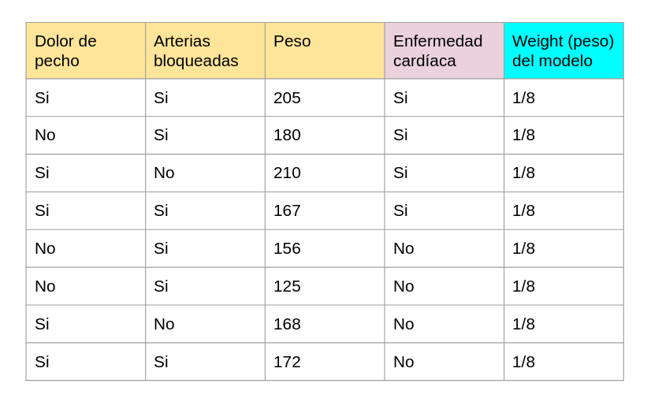
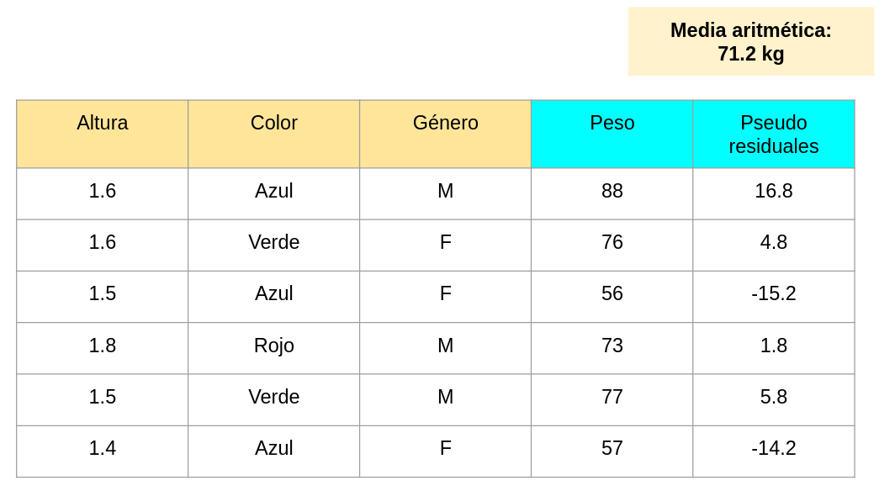
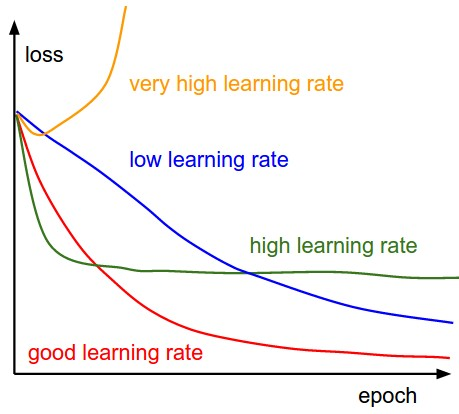
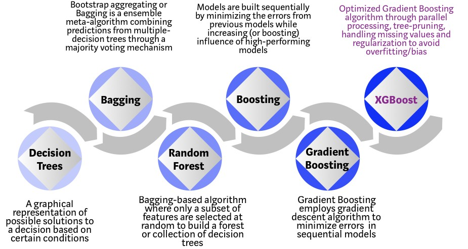

---
output:
  xaringan::moon_reader:
    lib_dir: libs
    css: xaringan-themer.css
    nature:
      highlightStyle: github
      highlightLines: true
      countIncrementalSlides: false
---

background-image: url(img/portada-flacso.png)
background-size: cover
class: animated slideInRight fadeOutLeft, middle

```{r xaringan-extra-styles, include=FALSE}
xaringanExtra::use_extra_styles(
  hover_code_line = TRUE,         #<<
  mute_unhighlighted_code = TRUE  #<<
)
```


```{r , echo=FALSE}
xaringanExtra::use_tachyons()
xaringanExtra::use_panelset()
```


```{r include=FALSE}
library(countdown)
```

```{r setup, include=FALSE}
options(htmltools.dir.version = FALSE)
```

```{r xaringan-themer, include=FALSE, warning=FALSE}
library(xaringanthemer)
#style_duo_accent(
#  primary_color = "#23395b",
#  secondary_color = "#23395b",
#  inverse_header_color = "#FFFFFF"
#)

style_duo_accent(
  header_font_google = google_font("Roboto", "500"),
  text_font_google   = google_font("Roboto", "400", "300i"),
  code_font_google   = google_font("Roboto")
)
```


```{r, message=FALSE, warning=FALSE, include=FALSE}
style_mono_accent(base_color = "#43418A")
```

```{r , message=FALSE, warning=FALSE, include=FALSE} 
library(fontawesome)
library(emo)
```


```{r xaringan-logo, echo=FALSE}
#xaringanExtra::use_fit_screen()
#xaringanExtra::use_logo("img/logo-tidymodels.png")
```


```{r xaringan-tachyons, echo=FALSE}
xaringanExtra::use_tachyons()
xaringanExtra::use_fit_screen()
```


# Machine Learning en Aplicaciones Espaciales


### Clase 3a. Ensembles. Boosting


---


## Boosting


.bg-near-white.b--dark-blue.ba.bw2.br3.shadow-5.ph4.mt2[

### En boosting tenemos una creación secuencial de modelos, y se trata de reducir el sesgo del estimador combinando estos modelos. El foco se va a poner en los modelos que tienen una performance pobre. 

### ¿Por qué?

### Porque vamos a ponderar esos errores para no cometerlos a futuro. 

]


---

## Comparación con bagging


```{r echo=FALSE, out.width = '80%',  fig.align='center'}
knitr::include_graphics("img/bagging-vs-boosting.jpeg")
```


.bg-near-white.b--dark-blue.ba.bw2.br3.shadow-5.ph4.mt2[

Recordemos que en bagging vamos a construir modelos de manera independiente, y luego hacer un promedio de esas predicciones. La combinación de modelos suele ser mas potente que un algoritmo que el estimador base por separado. 


]

---


# Flavours de boosting


* **Adaboost**: es el primer algoritmo de Boosting y como **algoritmo base utiliza "decision stumps"**, o árboles de decisión simples que constan de un nodo y dos raíces. Solo opera mediante iteraciones y ponderaciones. 

* **Gradient Boosting**: es una generalización de boosting para funciones de pérdida diferenciables. Es  un procedimiento preciso y efectivo que se puede usar para regresión y clasificación. 


* **XGBoost**: a diferencia del anterior incluye tratamiento nativo de nulls, y además, soporta paralelización. Esto significa que paraleliza la construcción de cada árbol, guardandolos en bloques de memoria pre-ordenados y los reutiliza. Se paraleliza el split-finding. 


---

class: inverse, center, middle

## AdaBoost

--

## =

--

## Adaptive Boosting


---

## Adaboost 

**Boosting para clasificación**


```{r echo=FALSE, out.width = '100%',  fig.align='center'}

```

---

## Adaboost 

**Boosting para regresión**


```{r echo=FALSE, out.width = '90%',  fig.align='center'}

```

---

class: inverse, center, middle

--

## Veamos como sucede esto 

--

## Paso a paso


---


### Vamos a crear árboles de decisión a partir de estos datos


```{r echo=FALSE, out.width = '80%',  fig.align='center'}

```


---


#### Vamos a asignar un peso a cada muestra 

**Ese peso (weight) es 1/n, en este caso, 1/8**

```{r echo=FALSE, out.width = '100%',  fig.align='center'}

```

---

## Decision stumps


.bg-near-white.b--dark-blue.ba.bw2.br3.shadow-5.ph4.mt2[


Un **decision stump** es un árbol de decisión de 1 nodo raíz y 2 nodos hijos. Es un árbol de decisión muy simple. En el caso de tener una variable continua, en el nodo raíz tenemos un threshold, como en este caso. 


]


```{r echo=FALSE, out.width = '60%',  fig.align='center'}

```


.footnote[Fuente: https://en.wikipedia.org/wiki/Decision_stump]
---

## 1er árbol de decisión

Primera variable: dolor de pecho

```{r echo=FALSE, out.width = '100%',  fig.align='center'}

```


---

## 1er árbol de decisión


Segunda rama del árbol

```{r echo=FALSE, out.width = '100%',  fig.align='center'}

```

---

## 2do árbol de decisión

Operamos con la segunda variable

```{r echo=FALSE, out.width = '100%',  fig.align='center'}

```


---

## 3er árbol de decisión

Operamos con la tercer variable
```{r echo=FALSE, out.width = '100%',  fig.align='center'}

```


---

class: inverse, center, middle

## Tenemos 3 árboles de decisión

--

## ¿Cuál va a ser el primer árbol a considerar?


---

## Calculemos el índice de Gini para nuestros árboles

```{r echo=FALSE, out.width = '100%',  fig.align='center'}

```


---

## Veamos las importancias que debemos asignar


```{r echo=FALSE, out.width = '100%',  fig.align='center'}

```

---

## Primer árbol de decisión


```{r echo=FALSE, out.width = '100%',  fig.align='center'}
knitr::include_graphics("img/ada9.png")
```


---


## Segundo árbol de decisión
```{r echo=FALSE, out.width = '100%',  fig.align='center'}

```

---

class: inverse, center, middle


## Vamos a recalcular los weights


---

## Cuando hay un error

```{r echo=FALSE, out.width = '100%',  fig.align='center'}

```

---


## Cuando hay un acierto

```{r echo=FALSE, out.width = '100%',  fig.align='center'}

```

---


## Tenemos los nuevos weights


```{r echo=FALSE, out.width = '100%',  fig.align='center'}

```


---

## Normalizamos los weights


```{r echo=FALSE, out.width = '100%',  fig.align='center'}

```


---

class: inverse, center, middle


## ¿Cómo van a influir

--


## estos nuevos weights?


---


```{r echo=FALSE, out.width = '130%',  fig.align='center'}

```


---

class: inverse, center, middle


## Si tuviese un mayor weight,

--

## esa muestra va a repetirse varias veces

--

## en el nuevo dataset


---

class: inverse, center, middle, 

## Retomando...


---

## Adaboost (pasos)

1. Asignamos los pesos (1/n) a cada muestra.

2. Creamos decision stumps para cada variable del dataset. 

3. Calculammos el índice de Gini. 

4. Según el error se calcula el Amount of Say. 

5. Recalculamos los pesos. 

6. Se repite el proceso. 

7. Se suman todas las predicciones de todos los decision stumps. 


---

class: inverse, center, middle

## Finalmente...

---


## Algoritmo de Adaboost

```{r echo=FALSE, out.width = '90%',  fig.align='center'}

```


.footnote[Fuente: *Applied Predictive Modeling*]

---

class: inverse, center, middle

## Gradient Boosting Machines


---


## Gradient Boosting


.bg-near-white.b--dark-blue.ba.bw2.br3.shadow-5.ph4.mt2[
* Al igual que AdaBoost es un algoritmo secuencial. 

]


.bg-near-white.b--dark-blue.ba.bw2.br3.shadow-5.ph4.mt2[

* A diferencia de AdaBoost:
1. utilizamos árboles de decisión, pero no necesariamente, decision stumps. 

2. No computamos los pesos en cada iteración, sino que se optimiza una función de pérdida diferenciable (loss function), por ejemplo, MSE para regresión. 

]


---

class: inverse, center, middle

## Veamos paso a paso


---

## Vamos a predecir el *peso* a partir de estas variables


**Estamos ante un caso de regresión**
```{r echo=FALSE, out.width = '90%',  fig.align='center'}

```


---

## Calculamos la media de esa variable 

```{r echo=FALSE, out.width = '100%',  fig.align='center'}

```

---

**A esa media le restamos el valor original de la variable**

Decimos pseudo-residuales porque los residuales son un concepto de regresión lineal.

```{r echo=FALSE, out.width = '100%',  fig.align='center'}

```

---

## Primer árbol de decisión

Uso los residuales en vez del valor verdadero 

```{r echo=FALSE, out.width = '100%',  fig.align='center'}

```


---

**Los valores que estan en la misma rama, los promediamos**

```{r echo=FALSE, out.width = '100%',  fig.align='center'}

```


---

**Si a la media aritmética de todas las muestras, le sumo el valor del residual, vemos q coincide con el valor verdadero**

```{r echo=FALSE, out.width = '100%',  fig.align='center'}
knitr::include_graphics("img/gbm6.png")
```


---


class: inverse, center, middle

## Vamos a introducir el concepto de 

--

## tasa de aprendizaje


---

## Tasa de aprendizaje

```{r echo=FALSE, out.width = '50%',  fig.align='center'}

```


.bg-near-white.b--dark-blue.ba.bw2.br3.shadow-5.ph4.mt2[

**Importante: definir una tasa de aprendizaje óptima, ya que si ese valor es muy grande: el algoritmo no converge, pero si es muy pequeño: vamos a necesitar muchos pasos o épocas para la convergencia**

]

---


**Agregamos la tasa de aprendizaje a nuestro modelo**

En este caso, definimos, una tasa de aprendizaje igual a 0.1. 


```{r echo=FALSE, out.width = '100%',  fig.align='center'}

```

---

## Recordemos

**En el contexto de una regresión lineal, siempre intentamos disminuir los residuales ya que eso implica disminuir el error en la predicción**


```{r echo=FALSE, out.width = '100%',  fig.align='center'}
knitr::include_graphics("img/reg-res.svg")
```


---

## Finalmente...

**Los residuales han disminuido**
```{r echo=FALSE, out.width = '100%',  fig.align='center'}

```


---

**Graficamente se ve así**


```{r echo=FALSE, out.width = '70%',  fig.align='center'}

```


---

## Learning rate y número de árboles


```{r echo=FALSE, out.width = '90%',  fig.align='center'}

```


.bg-near-white.b--dark-blue.ba.bw2.br3.shadow-5.ph4.mt2[

**Cuanto más pequeño sea el learning rate del algoritmo, más árboles (n_estimators) vamos a necesitar para lograr resultados óptimos**

]

.footnote[Fuente: *Hands On Machine Learning with Scikit-learn and Tensorflow*]

---


## Algoritmo Gradient Boosting 

*Está definido para clasificación*
```{r echo=FALSE, out.width = '100%',  fig.align='center'}

```

.footnote[Fuente: *Applied Predictive Modeling*]

---

class: inverse, center, middle

## XGBoost

--

## =

--

## Extreme Gradient Boosting


---

## XGBoost

* Presentado originalmente por T.Chen & C.Guestrin (2016). XGBoost: A Scalable Tree Boosting System

* Implementación escalable de GBM. 

* Árboles de decisión basados en CART. 

* Regularización para penalizar la complejidad de los árboles. 

* Derivadas de segundo orden para optimizar la función objetivo. 

* Opciones para hacer sampling de columnas y filas (similar a Random Forest). 


---

## XGBoost

* XGBoost = Extreme gradient boosting

--

**¿Qué nos ofrece XGBoost a diferencia de GBM?**

--


```{r echo=FALSE, out.width = '90%',  fig.align='center'}
knitr::include_graphics("img/xgboost-adv.png")
```


.footnote[*https://towardsdatascience.com/https-medium-com-vishalmorde-xgboost-algorithm-long-she-may-rein-edd9f99be63d*]

---

class: inverse, center, middle

## Optimizaciones que implementa XGBoost

## https://www.youtube.com/watch?v=oRrKeUCEbq8&t=112s 


---

### De árboles de decisión a XGBoost

```{r echo=FALSE, out.width = '100%',  fig.align='center'}

```

.footnote[Fuente: *https://towardsdatascience.com/https-medium-com-vishalmorde-xgboost-algorithm-long-she-may-rein-edd9f99be63d*]


---


## Tunning XGBoost en R


```{r echo=FALSE, out.width = '100%',  fig.align='center'}

```


---

class: inverse, center, middle


# Manos en R `r emo::ji("raised_hands")`


---

## Bibliografía


* Sebastian Raschka. 
https://www.youtube.com/watch?v=zblsrxc7XpM 

* Stochastic Gradient Boosting (paper) https://statweb.stanford.edu/~jhf/ftp/stobst.pdf 

* XGBoost: A Scalable Tree Boosting System (paper) https://arxiv.org/pdf/1603.02754.pdf 

* Videos de StatQuest

* AdaBoost: https://www.youtube.com/watch?v=LsK-xG1cLYA 

* Gradient Boosting (Parte 1): https://www.youtube.com/watch?v=3CC4N4z3GJc&t=260s

* XGBoost (Parte 1): https://www.youtube.com/watch?v=OtD8wVaFm6E&t=954s 

---